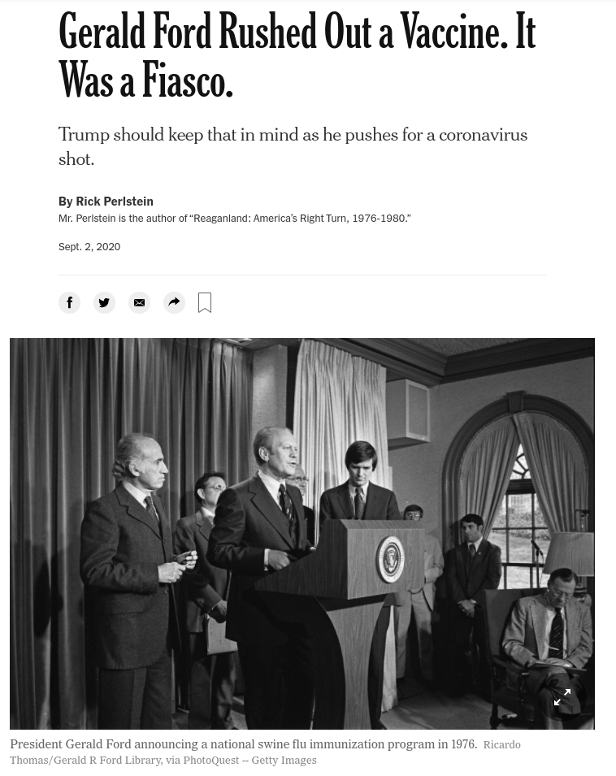
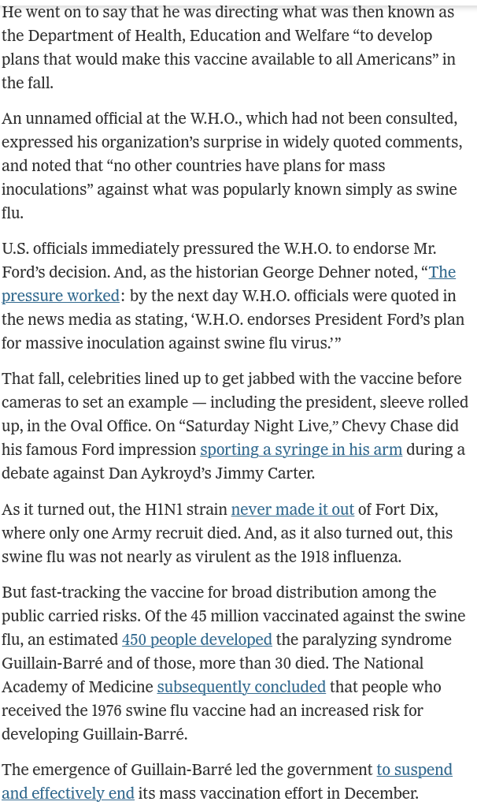
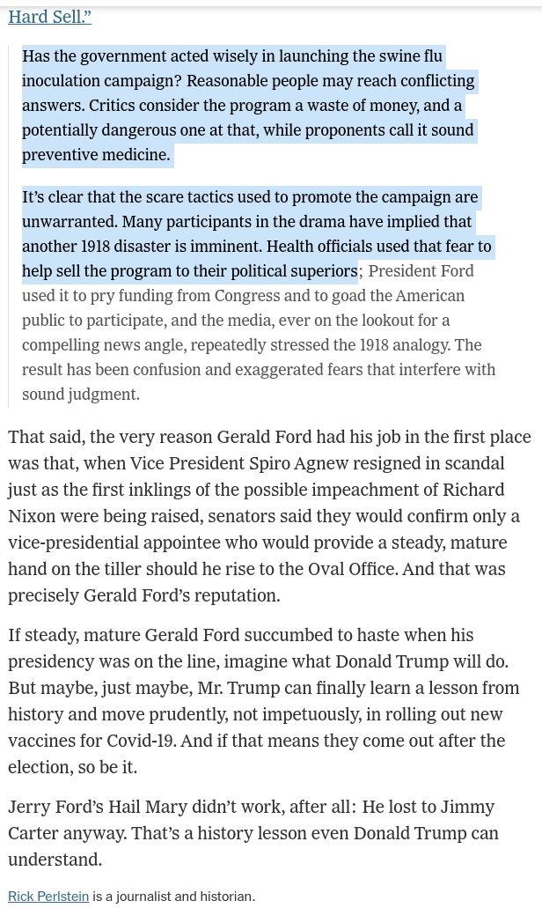
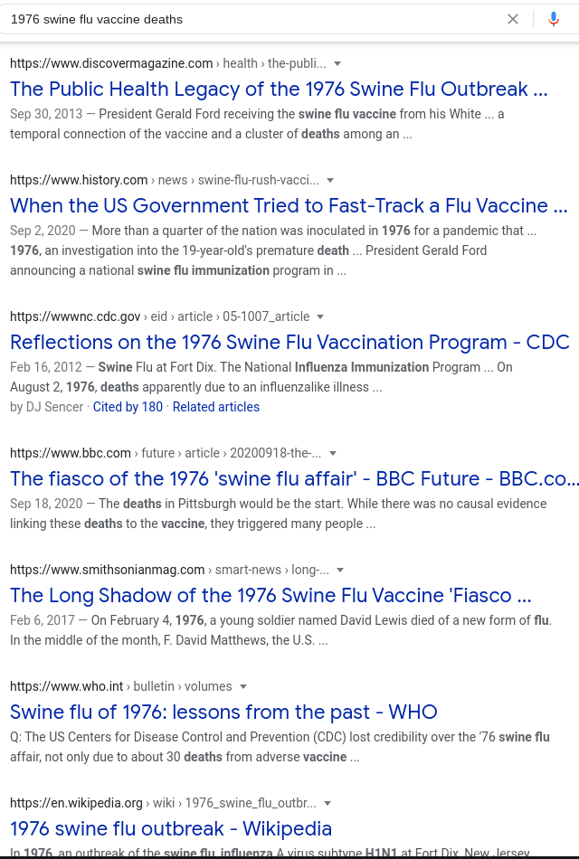
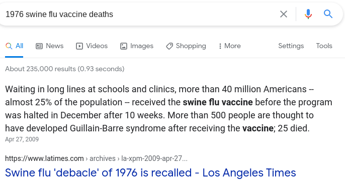
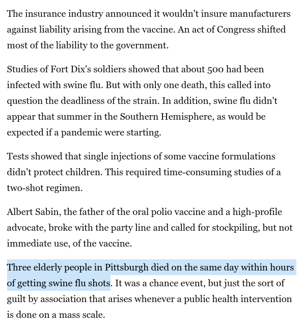

1976 Swine Flu Fiasco   
======================

.. contents::
  :local:

  
  1976 Swine Flu Pandemic: Ford Swine Flu 1975 Rushed Vaccine Fiasco  

.. figure:: assets/Vaccines/History-Lessons/1976-Swine-Flu-Pandemic/2-Ford-Swine-Flu-1975-pandemic-or-no-extraordinary-action.png
  :align: center
  :width: 80 %
  
  1976 Swine Flu Pandemic: Ford Swine Flu 1975 - Have a pandemic or take no extra-ordinary action  
  

  
  1976 Swine Flu Pandemic: Mass Innoculations  

  
  1976 Swine Flu Pandemic: Was Disaster Imminent?  
  

.. figure:: assets/Vaccines/History-Lessons/1976-Swine-Flu-Pandemic/Swine-Flu-1976-Carter-Califano-Weighing-Harm.png
  :align: center
  :width: 80 %
  
  Swine Flu 1976 - Carter aide Califano Weighing the Harm

  
  Swine Flu Vaccine 1976 Fiasco Google Search Results

  
  Swine Flu Vaccine - 40 million 10 injections in weeks  

.. figure:: assets/Vaccines/History-Lessons/1976-Swine-Flu-Pandemic/WPost-Swine-Flu-1-CDC-samples-in-soldiers.png
  :align: center
  :width: 80 %
  
  Washington Post - Swine Flu: CDC samples in soldiers

.. figure:: assets/Vaccines/History-Lessons/1976-Swine-Flu-Pandemic/WPost-Swine-Flu-2-unquestioned-gospel.png
  :align: center
  :width: 80 %
  
  Washington Post - Swine Flu: unquestioned gospel
  

  
  Washington Post - Swine Flu: Three Elderly died within hours
  

.. figure:: assets/Vaccines/History-Lessons/1976-Swine-Flu-Pandemic/WPost-Swine-Flu-4-What-killed-the-program-Guillain-Barre.png
  :align: center
  :width: 80 %
  
  Washington Post - Swine Flu: What killed the program: 500 cases of Guillain-Barre
  

Last change: |today|