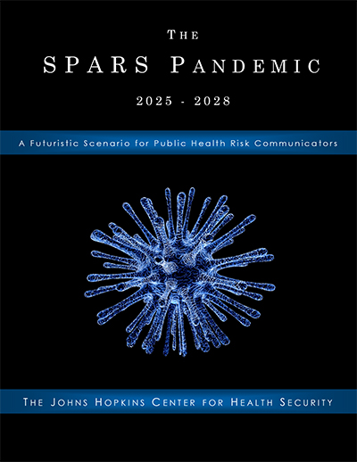

2017 Spars Pandemic Tabletop Communications Exercise - Johns Hopkins
=======================================================================

.. toctree::
    :maxdepth: 2
    :caption: Contents:
 
    2017-10-23_spars-scenario-center-news    

.. contents::
    :local:

.. Note:: 
    
    This page was Retrieved and copied March 30 2021
    
    https://www.centerforhealthsecurity.org/our-work/Center-projects/completed-projects/spars-pandemic-scenario.html

  Self-guided tabletop training experience challenges public health communicators and risk communication researchers to consider the complex messaging dilemmas of a future outbreak that requires development of a new vaccine

  Source `SPARS Pandemic scenario book (PDF) March 30 2021`_.

  .. _SPARS Pandemic scenario book (PDF) March 30 2021: https://www.centerforhealthsecurity.org/our-work/pubs_archive/pubs-pdfs/2017/spars-pandemic-scenario.pdf

SPARS pandemic scenario book

Last change: |today| 