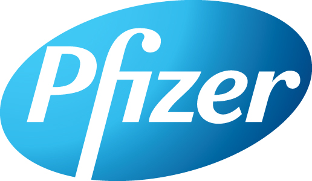

A History of Pfizer
=======================

.. contents::
  :local:

  
  Pfizer Logo

A history of Pfizer December 2, 2020

Credit to the source: adapted and revised from https://pharmaphorum.com/sales-marketing/a_history_of_pfizer/
March 5, 2021

Few companies embody the term ‘pharma giant’ as much as Pfizer. Here we take a look at the colourful history of one of the biggest drugmakers in the world.

Pfizer was founded in 1849 by two recent German immigrants to the USA, Charles Pfizer and Charles Erhart. Both in their mid-twenties, the two men set up what was initially a fine chemicals business in a Brooklyn factory, using a loan from Pfizer’s father as capital. The company’s first product, a palatable anti-parasitic drug, made to taste like toffee, united Pfizer’s skills as a chemist with Erhart’s training as a confectioner. It was a success, and set the pattern for the company’s future development.

Source `A history of Pfizer by pharmaphorum.com retrieved March 5 2021`_.

.. _A history of Pfizer by pharmaphorum.com retrieved March 5 2021: https://pharmaphorum.com/sales-marketing/a_history_of_pfizer/

.. figure:: assets/Vaccines/Pfizer/stock-photo-tokyo-may-pfizer-building-on-may-in-tokyo-pfizer-is-one-of-largest-pharmaceutical-106958480.jpg
  :width: 80 %
  
  Pfizer’s Tokyo building

The convulsion of the American Civil War, which broke out soon after in 1862, had as much of an impact on the nascent pharmaceutical industry as on American society in general. The “first industrial war” involved drug producers as much as weapons manufacturers. Like their competitor Squibb, the sudden need for enormous quantities of painkillers and antiseptics for the Union armies provided a great scope to expand production. By 1868, Pfizer’s revenues had doubled since the start of the war, and their product lines had expanded greatly.

After the war, Pfizer continued to focus on industrial chemicals as much as medicines, producing the citric acid needed for the emerging soft drinks industry, fuelling brands like Coca Cola and Dr Pepper’s expansion in the 1880s. This became their mainstay for many years, laying the basis for their continued growth. Also, when supply of tartaric acid was disrupted due to the civil war and increased tariffs, Pfizer developed its production to become the leading supplier of chemicals in the US.

.. note::
    “The ‘first industrial war’ involved drug producers as much as weapons manufacturers”

Erhart died in 1891, and Pfizer in 1906, leaving a company of around 200 employees in the hands of Emil Pfizer, who served as president until the 1940s, the last member of the Pfizer family to be involved in managing the company. Under his stewardship, Pfizer’s expertise in scientific production methods developed greatly. In 1919 their scientists pioneered mould fermentation production of citric acid from molasses, freeing their citric acid business from European citrus fruit supplies, which had been disrupted by the First World War. They developed a deep tank fermentation process, the principles of which would later be applied to the production of penicillin. As a consequence of Pfizer’s innovation, the price of citric acid tumbled over the succeeding decades, with the value of the chemical falling by 5/6ths in 20 years. In 1936 the company discovered a fermentation free method of producing vitamin C, which they rapidly expanded into vitamins B2 and B12 amongst others, rapidly becoming a leading vitamin producer – chemicals that were very novel at the time.

This expertise in fermentation and large-scale pharmaceutical production put Pfizer in good stead when in 1941 the US government appealed to the pharma industry for support in producing penicillin for the war effort. In an unprecedented collaboration, Pfizer worked with government scientists, the researchers such as Frederick Banting who had been working on the drug before the war, and a plethora of other players in the industry to markedly improve the efficiency of drug production, as they proudly state “most of the penicillin that [went] ashore with Allied force on D-Day [was] made by Pfizer”.

Antibiotics marked the transition to the modern Pfizer. Their follow-up to penicillin, Terramycin, first marketed in 1950, was both their first proprietary drug, and the first for which the company used sales reps, their soon to be formidable force of salesmen starting with just eight members.

Pfizer initiated its first major internationalisation at this stage, moving into nine new countries in 1951. It was at this time they set their site at Sandwich in the UK, initially just to finish processing compounds imported from America, but due to tariffs on imported products the company rapidly expanded the plant to accommodate producing medicines from scratch. Pfizer’s international expansion put great trust in their local staff compared to other organisations, recruiting nationals and giving them a great deal of autonomy.

.. note::
    “Lipitor…became the biggest-selling prescription medicine ever, earning Pfizer $12 billion a year in 2007, one quarter of its total sales”

The areas that Pfizer directed its research into expanded in these years as well. In 1952, it established its Agricultural Division, beginning its foray into animal health, and in 1953 acquired Roerig, a nutritional supplement specialist, which became incorporated as a division in its own right. By the 1960s, Pfizer were at their “most diversified point in [its] history” – in its own words, its interests “stretched from pills to perfume, and petrochemicals to pet products”.

Throughout the 60s and 70s the company continued to bring out new drugs, such as the broad spectrum antibiotic Vibramycin, and broadening its research base, reorganising its R&D operations in 1971 into a Central Research Division, and increasing spend on this area of the company from 5% to 15% of revenue. This attention to innovation began to pay off in the 1980s, with a series of blockbusters, the first of which, the COX inhibitor Feldene, arrived in 1980 rapidly becoming one of the biggest-selling anti-inflammatories in the world. Others rapidly followed, including Glucotrol, aimed at diabetics, and Procardia, an anti-hypertensive. The 1990s and 2000s would soon take this blockbuster-based success to new levels.

The statin Lipitor, approved in 1997 for Warner-Lambert before their merger with Pfizer, became the biggest-selling prescription medicine ever, earning Pfizer $12 billion a year in 2007, one quarter of its total sales. It almost hadn’t made it through clinical development, facing problems with ineffective chiral isomers and limited efficacy in animal testing, but showed such impact in human trials that it blew the competition away.

But Pfizer’s almost Hollywood-level blockbuster of the 1990s was the little blue pill of Viagrar. Formulated initially at the Sandwich site in the UK as an anti-hypertensive, it was found have “unexpected” side effects that made the company rapidly change the indication to erectile dysfunction. But despite the cultural ubiquity, Viagra has recently faced the inevitable threat from competition and generics, dropping from 92% of the ED market in 2000 to around 50% in 2007, with vigorous competition from drugs such as Cialis and Levitra.

.. note::
    “Pfizer is the 6th largest lobbier in Washington, and spent $25 million on lobbying during the passing of Obama’s healthcare reform legislation alone”

Ups and downs
-----------------------

Like most pharma companies of its size, Pfizer has faced its fair share of controversy as one of the most well-known drugmakers in the world.

In 2009, Pfizer faced more than $2 billion in legal settlement payments over marketing practices for drugs, and around the same time announced it would close a large number of manufacturing and R&D sites worldwide, including its Sandwich facility, which at the time employed 2,400 people (though it ended up maintaining a reduced presence at the site).

In the late 2000s/early 2010s, Pfizer, like many other big pharma companies, was experiencing pipeline difficulties too, with drugs accounting for 40% of its sales coming off patent, and a series of high-profile failures of drugs in development, such as the anti-cholesterol drug torcetrapib that caused a marked increase in deaths compared with the control group in clinical trials. The news of this disastrous result came days after CEO Jeff Kindler had hailed the drug as potentially “one of the most important compounds of our generation”. Likewise, tanezumab, an anti-osteoarthritic, failed in trials.

However, these challenges in the core mission of drug discovery led Pfizer to focus on other means of keeping up its dominant position. One thing that highlighted this changed focus was the appointment of Kindler as CEO in 2006. Kindler was trained as a lawyer, and was a relatively new employee when he was given the top job in preference to others of much longer standing with scientific experience, highlighting the increasing importance of legal and marketing issues over traditional R&D. He was succeeded by Ian Read and later Albert Bourla.

Perhaps unsurprisingly for the biggest company in one of the biggest industries in the world, Pfizer has also been proficient in exerting its considerable political influence to preserve its interests, coming in as the 6th largest lobbier in Washington, and spending $US 25 million on lobbying during the passing of Obama’s healthcare reform legislation alone. It has been key in pushing counterfeit drugs up the political agenda, in part due to its ownership of that most counterfeited of drugs, Viagra. It has also been highly critical of parallel trade, and has been one of those militating for a pharmaceutical repackaging ban in the EU.

Despite this political clout, the company also tried to belay its image as a pharma monster, like many others in the industry, by spending generously on charity, donating AIDS drugs both to poor communities in the US, and to developing countries.

The era of mega-mergers
-----------------------

Since the turn of the millennium, Pfizer has embarked on a series of mega-mergers, gobbling up Warner-Lambert in 2000, Pharmacia and Upjohn in 2002, Wyeth in 2009, and Medivation in 2016.

In 2015 the company also paid $17 billion to acquire Hospira, a firm specialising in injectable drugs and biosimilars, at a time when copycat biologics were starting to make real waves in the market. The deal seemed to be a precursor to Pfizer’s plans to separate its patent-protected medicines business from its off-patent portfolio.

These plans were soon abandoned and Hospira has remained a key part of the core Pfizer organisation – but that didn’t put the idea of separate business units to rest completely.

In 2017/2018 Pfizer attempted to sell its consumer health unit, but buyers including Proctor & Gamble and GSK pulled out of negotiations.

This caused Pfizer to change its tactics, and instead the company ended up signing a deal with GSK to combine the two companies’ consumer health businesses and form a joint venture with combined annual sales of $12.7 billion.

Pfizer and GSK plan to divest the business completely in the long term and reap the rewards, while merging the two businesses is also expected to create cost savings for both partners.

Similarly, in 2019 Pfizer announced a deal to merge its Upjohn generics business with Mylan, creating a combined company called Viatris. The $12 billion deal was cleared in November 2020, creating a generics behemoth with annual sales of around $19 to $20 billion and operations in 165 markets around the word.

This era, though, was also marked by two major failed acquisitions, which both courted controversy due to Pfizer’s intention to exploit tax loopholes.

In 2014 the company made an offer of around $100 billion to acquire UK firm AstraZeneca (which at the time was going through a rough patch).

AZ seemed to have little interest in the idea, and the deal was instantly controversial in both Europe and the US. The merger would have created the biggest pharmaceutical company in the world – and would have given Pfizer a way to avoid paying costly US taxes on foreign earnings (a stance that president Barack Obama criticised heavily).

Indeed, critics feared this redomiciling was the main aim of the merger, and that Pfizer wouldn’t sustain investment in UK R&D in the long term.

Unusually, the UK parliament ended up getting involved, perhaps underlining the importance of AZ to the country’s life sciences sector, with both AZ and Pfizer asked to argue for the future of the company in parliamentary hearings. Pfizer seemed unable to allay the concerns of prime minister David Cameron and business secretary Vince Cable.

After numerous “friendly bids” and just as many rejections, Pfizer eventually made a final offer of £69.3 billion ($118 billion) – which was also turned down by AZ, with the company saying it was “inadequate”.

Leif Johansson, AZ’s chairman, did not mince his words, saying: “Pfizer’s approach throughout its pursuit of AstraZeneca appears to have been fundamentally driven by the corporate financial benefits to its shareholders of cost savings and tax minimisation.

“From our first meeting in January to our latest discussion yesterday, and in the numerous phone calls in between, Pfizer has failed to make a compelling strategic, business or value case. The Board is firm in its conviction as to the appropriate terms to recommend to shareholders.”

This did not stymie Pfizer’s desire to move its HQ out of the US, though. The next year it also attempted a ‘reverse takeover’ of Irish Pharma firm Allergan – where, technically, Allergan would acquire the US company and rename itself as Pfizer, allowing Pfizer to have its tax base in Ireland.

.. note::
    At the time $160 billion deal was the biggest ever seen in the pharma sector.

But soon the Obama administration came down hard on such ‘tax inversion’ deals, changing laws such that the deal was no longer attractive to Pfizer.

No signs of slowing down
---------------------------

Despite some setbacks, Pfizer remains one of the biggest pharma companies in the world today. The sheer size of the organisation is mindboggling, totalling well over 100,000 employees. One commentator compared the company’s 38,000 sales reps to “three army divisions”, a sales team that has been immortalised in a Hollywood rom-com of all things – Love and Other Drugs, starring Jake Gyllenhaal and Anne Hathaway.

And with the company becoming one of the first in the world to get a COVID-19 vaccine approved – via its collaboration with  BioNTech – it feels like we’re only on the cusp of seeing where the company could head in the future.

Pfizer’s sheer diversity and economies of scale likely mean it will have the power to shape the pharmaceutical industry well into the 21st century. With fingers in every pie, ranging from small molecules to biologics in every clinical area, to stem cells and consumer goods, Pfizer will surely celebrate its 200th anniversary in as strong a position as it spent the last 160 years.

For all the latest Pfizer news follow pharmaphorum’s Pfizer tag.

Last change: |today|