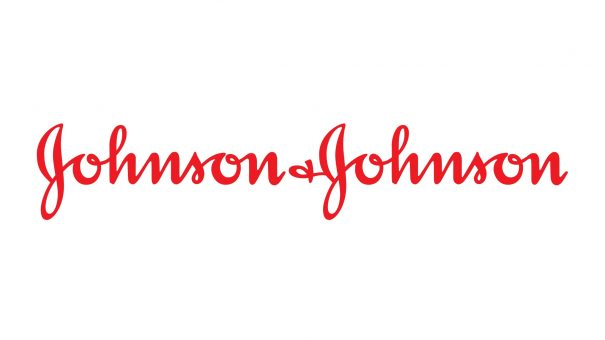

A history of Johnson & Johnson
===============================

.. contents::
  :local:

  February 26, 2021

  Credit to the source: `adapted and revised from pharmaphorum.com`_. 
.. _adapted and revised from pharmaphorum.com: https://pharmaphorum.com/views-analysis-sales-marketing/a-history-of-johnson-johnson/

March 5, 2021

By most measures the single largest pharma company in the world, US-based Johnson & Johnson (J&J) is also arguably one of the most well-known drugmakers among the general public. 

Both these factors can be tied in part to J&J’s strong presence in the consumer sector – but behind household name products is a strong pharmaceutical backbone that has emerged over the company’s long and varied history.

Johnson & Johnson was founded over 125 years ago in the year 1886. However, it wasn’t until 1959 – 73 years and two major acquisitions later – that J&J developed its significant presence in the pharmaceutical industry.

Where it all began
---------------------------

In 1886, three brothers – Robert Wood Johnson, James Wood Johnson and Edward Mead Johnson – founded Johnson & Johnson, in New Brunswick, New Jersey in the United States. It’s said that the Johnson brothers were inspired to start the business in order to create a line of ready-to-use surgical dressings, after hearing a speech by antiseptic advocate Joseph Lister in 1885. Robert Wood Johnson served as the first president – the company became incorporated in 1887 and throughout the nineteenth century, Robert worked to improve sanitation practices.

.. note::
    “J&J pioneered the first commercial first aid kits, which were initially designed to help railroad workers, but soon became the standard practise in treating injuries”
 

A year later, J&J pioneered the first commercial first aid kits, which were initially designed to help railroad workers, but soon became the standard practise in treating injuries. In 1894, J&J’s heritage baby business began, by the launch of maternity kits. These kits had the aim of making childbirth safer for mother and babies. Johnson’s Baby Powder also went on sale during this year and was extremely successful. Robert Wood’s granddaughter, Mary Lea, was the first baby to be used on the baby powder label.

Between 1896 and 1897, J&J enabled a huge step forward for women’s health when it manufactured the first mass-produced sanitary protection products.

When Robert Wood died in 1910, his brother James Wood became president, before James’ son, Robert Wood Johnson II became president in 1932.

One of J&J’s subsidiaries is Ethicon, which is a manufacturer of surgical sutures and wound closure devices. It was incorporated as a separate company in 1949 so as to expand and diversify the J&J product line. Following World War II, Ethicon’s market share in surgical sutures rose from 15% to 70% worldwide.

In 1959, J&J acquired McNeil Laboratories in the US and also Cilag Chemie, AG in Europe. These two acquisitions enabled the company to gain a significant presence in the field of pharmaceutical medicines for the first time. One McNeil product was the first prescription aspirin-free pain reliever, Tylenol (acetaminophen) elixir for children.

The joining of Janssen
---------------------------

It was in 1961 that Belgium’s Janssen Pharmaceutica N.V. joined the J&J Family of Companies. Its founder, Dr Paul Janssen, is recognised as one of the most innovative and prolific pharmaceutical researchers of the 20th century.

Today, Janssen is one of the world’s leading research-based pharma companies and markets prescription medicines in the areas of gastroenterology, women’s health, mental health, neurology and HIV/AIDS, to name a few.

.. note::
    “Dr Paul Janssen is recognised as one of the most innovative and prolific pharmaceutical researchers of the 20th century”
 

United under the common name of J&J, Janssen is now split into three different businesses – Janssen Research & Development, Janssen Healthcare Innovation and Janssen Diagnostics. Some of the most well-known Janssen products include diarrhoea treatment, Immodium (loperamide), antipsychotic Risperdal (risperidone) and Alzheimer’s disease drug, Reminyl (galantamine).

Risperdal is well-known due to the controversy in the US following its product launch in 1994. Juries in several US states found J&J guilty of hiding information about adverse effects of the antipsychotic medication. In 2012, J&J agreed to pay US $181 million to 26 states in order to settle these claims – though another lawsuit related to the drug (for $8 billion, eventually reduced to $6.8 billion) hit the company in 2019.

Litigation & controversy
---------------------------

This is not the only controversy J&J has had to deal with in recent years. 

The company has also faced claims that it did not adequately communicate the risks of its opioid painkillers in its marketing, contributing to the US’ ‘opioid epidemic’, and that its talc products could contain small amounts of asbestos and lead to cancer.

.. note::
    The company has been hit with billions of dollars in lawsuits relating to these charges 

J&J has been bullish in both its insistence that the claims are inflated or false and that it can easily deal with the lawsuits, but the company has both won and lost existing cases, with many still caught up in appeals processes, and it remains to be seen how the balance will eventually play out.

Acquisitions post-Janssen
---------------------------

Between 1976 and 1989, James E. Burke was chairman and CEO of J&J. During this tenure, J&J entered into the areas of vision care, mechanical wound closure and diabetes management. It was also during this time that J&J opened the first operating companies in China and Egypt.

During the 1990s, Ethicon’s Endo-Surgery pioneered minimally invasive surgery, which uses very small incisions and helps patients recover faster than with traditional surgery.

In 1994, the first coronary stent was created by J&J and was called the Palmaz-Schatz stent. This move revolutionised cardiology – coronary stents keep vessels open so blood can flow to the heart. Later, another of J&J’s companies, Cordis Corporation, introduced the first drug-eluting stent, which helped prevent the arteries from re-clogging. Cordis was founded in Miami in 1959 and develops and produces medical equipment to treat patients who suffer from cardiovascular disease.

CEO Alex Gorsky, who was appointed in 2012

Beginning in 2003, J&J became involved in a series of litigations with Boston Scientific involving patents covering heart stent medical devices. Both parties claimed that the other had infringed upon their patents. The litigation was settled in 2009, when Boston Scientific agreed to pay $716 million in September and an additional $1.73 billion the following February.

William C. Weldon became the Chairman and CEO of J&J in 2002. Under his leadership, the company entered new therapeutic areas. One of these new areas was HIV/AIDS, which came about through the acquisition of Tibotec-Virco BVBA, to help address the vast unmet needs of patients with these diseases and other infectious diseases like tuberculosis.

In 2006, J&J acquired Pfizer Consumer Healthcare for $16.6 billion in cash. The acquisition included worldwide leading brands such as Listerine oral care products and the Nicorette line of smoking cessation treatments.

2017 saw J&J make its biggest ever acquisition deal after fighting off competition from Sanofi to acquire Swiss biotech Actelion for $30 billion. The company brought with it a group of medicines that treat pulmonary arterial hypertension – well-established blockbuster Tracleer (bosentan), and the more recently-approved Opsumit (macitentan) and Uptravi (selexipag), as well as a slew of pipeline products. 

And at the tail end of 2020, a $6.5 billion deal to buy Momenta meant that J&J added potential inflammatory disease blockbuster nipocalimab to the pipeline at Janssen.

COVID and beyond
---------------------------

J&J’s size meant that it had the resources to bring to bear against COVID-19 as the pandemic ravaged the world in 2020 and 2021, and the company soon began work on its own vaccine in partnership with the US government.

The vaccine was pipped to the post in approval by Pfizer and AstraZeneca’s offerings, and showed lower efficacy in trials, but the company is hoping for an advantage with its single shot dosing, as opposed to the double shot approach of many of its key rivals, as well as its comparatively easier storage. 

As with most of the pharma industry, J&J’s financials were hit by COVID uncertainty in 2020, the impacts of which may be felt for years to come.

The company has many interesting drugs in its pipeline, including a CAR-T therapy developed in partnership with Legend Biotech. But like many of its big pharma peers, it faces increased pressure on some of its biggest brands, as expiring patents pave the way for generic competition while biosimilars undercut sales of biologics.

Products whose sales have taken a hit include prostate cancer drug Zytiga and inflammatory diseases drug Remicade.

But ultimately these dips are likely to only be blips on the radar for J&J. It still easily holds the position of largest pharma company in the world by revenue, and there’s little that is likely to change that in the foreseeable future. 

For all the latest pharma news on Johnson & Johnson, follow pharmaphorum’s J&J and Janssen tags.

Last change: |today|