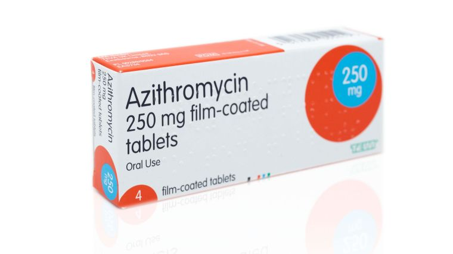

Azithromycin
===============

.. contents::
  :local:

  
  azithromycin-250-mg-tablets

Common brands: Zithromax, Zithromax Z-Pak, Zmax

Antibiotics
------------

It can treat various types of infections, including pink eye (bacterial conjunctivitis).

Brands
---------

Brands: Zithromax, Zithromax Z-Pak, Zmax, AzaSite, and Zithromax TRI-PAK

Availability
--------------

Availability: Prescription needed

Pregnancy
------------

Pregnancy: No known risks

Alcohol
---------

Alcohol: Interactions can occur

Drug Class
-----------

Drug class: Macrolide

  
  azithromycin 250 mg tablets

  
  azithromycin 

Additional Studies and Reports about Azithromycin
------------------------------------------------------------

Last change: |today|