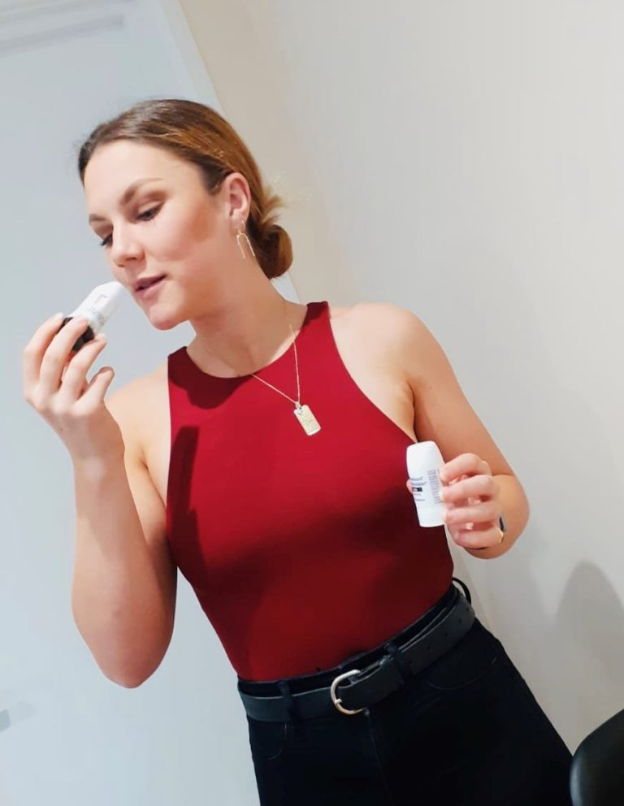

Budenside Inhaler 
===========================================================================================

.. toctree::
   :maxdepth: 2
   :caption: Contents:

.. contents::
    :local:

  
  Budesonide Inhaler

findings from 146 people – of whom half took 800 micrograms of the budesonide inhaler twice a day and half were on usual care – suggests that inhaled budesonide reduced the relative risk of urgent care or hospitalisation by 90% in the 28-day study period

.. Note:: 
    
    This page was Retrieved and copied April 16 2021
    
    https://twitter.com/ThomasConnors/status/1382158993632681990

https://twitter.com/ThomasConnors/status/1382158993632681990

10:29 PM · Apr 13, 2021·Twitter for Android

Common asthma treatment reduces need for hospitalisation in COVID-19 patients, study suggests
https://oxfordbrc.nihr.ac.uk/common-asthma-treatment-reduces-need-for-hospitalisation-in-covid-19-patients-study-suggests/

.. Note:: 
    
    This page was Retrieved and copied April 16 2021
    
    https://oxfordbrc.nihr.ac.uk/common-asthma-treatment-reduces-need-for-hospitalisation-in-covid-19-patients-study-suggests/

8 February 2021 · Listed under COVID-19, Respiratory

FacebookTwitterLinkedInShare
Early treatment with a medication commonly used to treat asthma appears to significantly reduce the need for urgent care and hospitalisation in people with COVID-19, researchers at the University of Oxford have found.

146 people took part in the trial.
The STOIC study found that inhaled budesonide given to patients with COVID-19 within seven days of the onset of symptoms also reduced recovery time. Budesonide is a corticosteroid used in the long-term management of asthma and chronic obstructive pulmonary disease (COPD).

Findings from the phase 2 randomised study, which was supported by the NIHR Oxford Biomedical Research Centre (BRC), were published by The Lancet Respiratory Medicine [Note: this article was updated to include publication of peer-reviewed paper]

The findings from 146 people – of whom half took 800 micrograms of the medication twice a day and half were on usual care – suggests that inhaled budesonide reduced the relative risk of requiring urgent care or hospitalisation by 90% in the 28-day study period. Participants allocated the budesonide inhaler also had a quicker resolution of fever, symptoms and fewer persistent symptoms after 28 days.

Professor Mona Bafadhel of the University’s Nuffield Department of Medicine, who led the trial, said: “There have been important breakthroughs in hospitalised COVID-19 patients, but equally important is treating early disease to prevent clinical deterioration and the need for urgent care and hospitalisation, especially to the billions of people worldwide who have limited access to hospital care.

“The vaccine programmes are really exciting, but we know that these will take some time to reach everyone across the world. I am heartened that a relatively safe, widely available and well studied medicine such as an inhaled steroid could have an impact on the pressures we are experiencing during the pandemic.”

The study also demonstrated that there was a reduction in persistent symptoms in those who received budesonide. Prof Bafadhel, a Respiratory Consultant also working at the Oxford University Hospitals NHS Foundation Trust, said: “Although not the primary outcome of study, this is an important finding.

“I am encouraged to see the reduction in persistent symptoms at 14 and 28 days after treatment with budesonide. Persistent symptoms after the initial COVID-19 illness have emerged as a long-term problem. Any intervention which could address this would be a major step forward.”  

The trial was inspired by the fact that, in the early days of the pandemic, patients with chronic respiratory disease, who are often prescribed inhaled steroids, were significantly under-represented among those admitted to hospital with COVID-19.

As well as the Oxford BRC, the STOIC trial was supported by AstraZeneca.

Last change: |today|