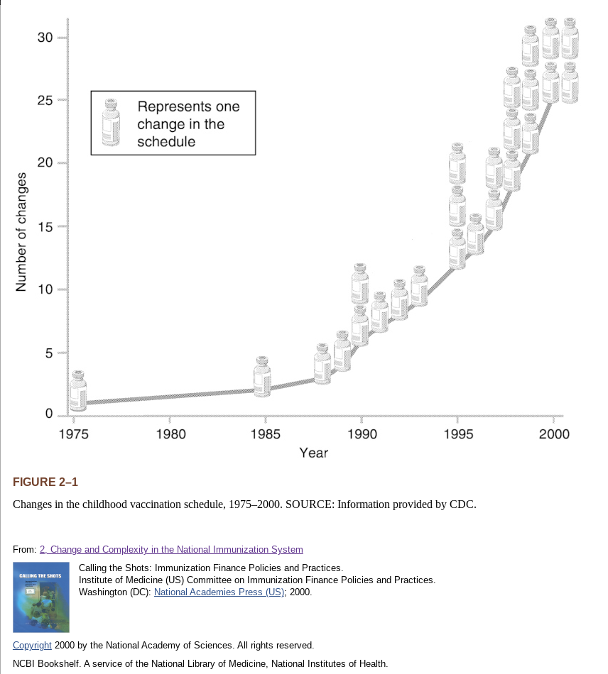
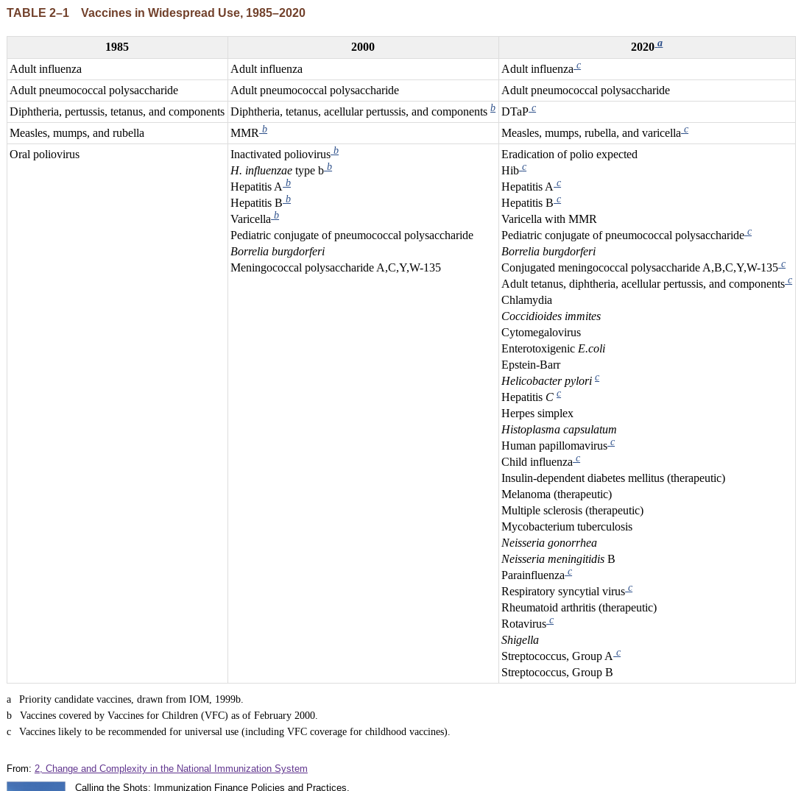

Children's Vaccine Recommended / Required / Widely Available Schedule 1960's to 2018 
======================================================================================

.. contents::
  :local:

1970-Vaccine-Schedule   
------------------------------------------------------------------------------

.. figure:: assets/1970-Vaccine-Schedule.png
  :width: 80 %
  :alt:  1970 Vaccine Schedule

1985 Vaccine Usage USA   
------------------------------------------------------------------------------

.. figure:: assets/1985-vaccine-usage.jpg
  :width: 80 %
  :alt:  1985 vaccine usage

Changes in the childhood vaccination schedule 1975-2000    
------------------------------------------------------------------------------

Vaccines in Widespread Use 1985-2020 
------------------------------------------------------------------------------

1994-1995 Vaccine Schedule   
------------------------------------------------------------------------------

.. figure:: assets/1994-1995-Vaccine-Schedule.png
  :width: 80 %
  :alt:  1994 1995 Vaccine Schedule

1995 Vaccine Schedule   
------------------------------------------------------------------------------

.. figure:: assets/1995-Vaccine-Schedule.png
  :width: 80 %
  :alt:  1995 Vaccine Schedule

2018 Vaccine Schedule   
------------------------------------------------------------------------------

.. figure:: assets/2018-Vaccine-Schedule.png
  :width: 80 %
  :alt:  2018-Vaccine-Schedule

Last change: |today|