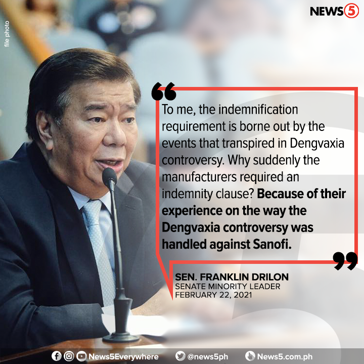
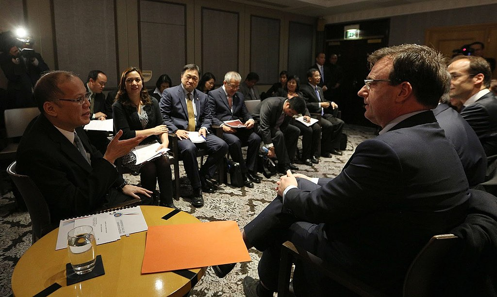

Dengvaxia - 2016 Sonofi Phillipines Denge Fever Deaths and Halt of Use
========================================================================
 

Dengvaxia controversy

.. contents::
  :local:

From Wikipedia, the free encyclopedia

https://en.wikipedia.org/wiki/Dengvaxia_controversy

The Dengvaxia controversy (Tagalog pronunciation: [dɛŋˈvakʃa]), also known as the Dengvaxia issue and Dengvaxia mess,[1] in the Philippines involved a vaccination program run by the Philippine Department of Health (DOH).[2] The DOH vaccinated schoolchildren with Sanofi Pasteur's Dengvaxia vaccine against Dengue fever.

The program was stopped when Sanofi Pasteur advised the government that the vaccine could put previously uninfected people at a somewhat higher risk of a severe case of dengue fever.[3] A political controversy erupted over whether the program was run with sufficient care and who should be held responsible for the alleged harm to the vaccinated children.:

In late November 2017, the DOH suspended the school-based vaccination program.[4][5]

As of August 2019, over 600 people (mostly children) that had received at least a single dose of the vaccine had died,[6] though not necessarily caused by the vaccine itself. The DOH has since banned the vaccine's use and sale in the Philippines.[7] The scare caused by the controversy has been suggested as a factor in the country's loss of confidence in vaccines and low immunization rates,[8] resulting in an infectious disease crisis in the country in 2019,[9] including a measles outbreak.[citation needed]

.. toctree::
   :maxdepth: 3
   :caption: Contents:

Events
-------

President Aquino converses with Sanofi Pasteur CEO Olivier Charmeil during a courtesy call on December 1, 2015, in Paris, France.

On December 1, 2015, former President Benigno Aquino III met with executives of Sanofi Pasteur in a courtesy call in Paris, making the Philippines the first Asian country to approve the commercial sale of Dengvaxia.[10]

Click to enlarge

.. figure:: assets/President_Aquino_at_the_launching_of_dengue_vaccine_school-based_immunization_in_Region_III.jpg
  :width: 80 %
  :alt:  President Benigno Aquino III at the launching of the dengue vaccine school-based immunization program.

President Benigno Aquino III at the launching of the dengue vaccine school-based immunization program.

President Benigno Aquino III at the launching of the dengue vaccine school-based immunization program.

In April 2016, the DOH, launched the dengue vaccination campaign in Central Luzon, Calabarzon and Metro Manila, where about 700,000 individuals received at least one dose of the vaccine.[11] The government paid P3.5-billion for the vaccine.[10]

On November 29, 2017, French drugmaker Sanofi Pasteur released a statement stating that their Dengue vaccine, Dengvaxia, posed risk to individuals vaccinated without having a prior dengue infection.[12][13] This came some time after reports circulated of children dying allegedly from complications associated with the vaccine.[5] Soon after, the Philippine Department of Health (DOH) suspended the vaccination on FCS program based in schools owing to the said concern,[14] with DOH Secretary Francisco Duque saying "In the light of this new analysis, the DOH will place the dengue vaccination on hold while review and consultation is ongoing with experts, key stakeholders and the World Health Organization."[11] On December 2, 2017, the government of Makati immediately suspended its anti-dengue vaccination drive following its statement.[15]

In its statement, pharmaceutical company Sanofi Pasteur reported concerns that Filipinos, mostly schoolchildren, could potentially be at risk of a more severe disease, where the recipient of the vaccine had not had a previous dengue infection; however, a medical director of Sanofi said that the dengue vaccination would not cause "severe dengue." [16] On December 4, 2017, Sanofi also denied that they made Filipinos into “guinea pigs,” explaining that the vaccine program was conducted by the DOH and not them.[17][18] Senator JV Ejercito, chair of the Senate Committee on Health and Demography, sought to identify by January 2018 whether there was an irregularity in the procurement of the vaccine,[19] while Senator Risa Hontiveros urged the government to address the health threats posed by the vaccine.[20] The Food and Drug Administration of the Philippines ordered Sanofi to stop distributing of Dengvaxia into the country.[21][22] Former Health Secretary Janette Garin said she welcomed the investigation which will be conducted by the Philippine Department of Justice.[23] Presidential spokesperson Harry Roque told the media that 10 percent of the 733,000 to 830,000 schoolchildren were at risk of dengue infection.[24] Since then, the Philippine Department of Education has closely monitored the students who have been injected by the vaccine.[25] Hontiveros said that Sanofi should take liability for the medical expenses of those who contracted severe dengue fever after receiving doses of the vaccine.[26]

Sanofi representative Thomas Triomphe "was forced to apologize" during the House of Representatives hearing on the Dengvaxia dengue vaccine.[27] Former President Benigno Aquino III, who approved the vaccination program in 2016, expressed interest in attending the Senate hearing.[28] On December 16, Aquino told reporters that "With the announcement of Sanofi and the reactions to it, there has been a lot of tension building up and I think it is incumbent upon me even as a citizen to try and allay certain fears, to put it in the proper perspective, to put it on the proper level."[29]

Secretary Duque reminded the public, especially parents, that "the vaccine is not a 'standalone' preventive measure against dengue."[30] On December 15, 2017, former Education and Skills Development chief Augusto Syjuco Jr filed "mass murder and plunder" complaints against Aquino and former health secretary Janette Garin over the controversial vaccination program.[31] Former health secretary Enrique Ona blamed his successor Janette Garin, who advised former president Benigno Aquino lll to purchase the Dengvaxia.[32]

On February 2, 2018, the University of the Philippines-Philippine General Hospital (UP-PGH) issued a report stating that three out of 14 children who died after receiving Dengvaxia indicated dengue despite immunization.[33] On February 3, a group of doctors, including former health secretary Esperanza Cabral, urged the Public Attorney's Office (PAO) to stop conducting autopsies.[34]

On February 5, 2018, during a probe at the House of Representatives, mothers of children who took part in a mass vaccination program confronted Garin, screaming at her and accusing her of killing their children. The women would later admit to the media that none of their children died after vaccination.[35]

On February 21, 2018 Senator Richard Gordon said that the DOH must be liable for the controversy.[36] On March 13, Senator Gordon formally terminated the investigation of the controversy.[37]

On February 26, 2018, Aquino appeared for the first time at a House inquiry about the controversy; he said that the controversy has been "politicized," [38] but the Malacañang Palace distanced itself from Aquino's allegations.[39]

On February 27, 2018, the opposition Representatives such as Gary Alejano of Magdalo and Edcel Lagman of Albay urged President Rodrigo Duterte to intervene in the dispute between the PAO and DOH.[40] On March 3, about 200 families of Dengvaxia vacinees joined the advocacy run held in Quezon Memorial Circle.[41]

In 2018, Dengvaxia was approved in Europe[42] and USA in 2019.[43]

Dengvaxia is approved for sale in 19 countries, including the European Union and the USA, and has saved an estimated 1 million lives.[44]

Charges
---------

On April 5, Public Attorney's Office filed the criminal charges (reckless imprudence resulting in homicide under Article 365 of the Revised Penal Code and violation of Republic Act No. 9745 (Anti-Torture Act) and torture) against the Former Health Secretary Janette Garin and other former officials.[45][46] However, Garin said that the charges have no basis and vowed to file a counter-charge against PAO.[47] The families of four children — Aejay Bautista (11), Lenard Baldonado (10), Zandro Colite (11), and Angelica Pestilos (10), whose deaths had been linked to Dengvaxia — also filed the charges.[48]

On April 19, PAO filed criminal complaints before the Department of Justice (DOJ), including the incumbent Health Secretary Francisco Duque III, following the death of the 13-year-old girl after receiving Dengvaxia on November 17, 2017.[49] Duque fires back by describing the charges against him as "malicious and oppressive" and he also said that he has nothing to do with the implementation of the dengue immunization program since he was seated as the secretary last October 2017.[50]

Gordon's draft report
-----------------------

On April 15, 2018 Gordon said he expected at least 10 senators to sign his report holding former President Benigno Aquino III and other officials liable.[51] Senator Panfilo Lacson will not sign the report due to "unreasonable comments" about him.[52] On April 17, Aside from Gordon, who already signed the report, Senators Ralph Recto, Manny Pacquiao, Win Gatchalian, Tito Sotto, Gregorio Honasan, Juan Miguel Zubiri, JV Ejercito, Nancy Binay, and Grace Poe have signed.[53] On April 20, Senator Sonny Angara also signed.[54]

Casualties and consequences
-----------------------------

132 autopsies have been performed that point to the vaccine as a probable cause of death.[6] Many of the victims' parents blamed the dengue vaccine for their children's deaths.[55]

Most of the deaths were caused by internal bleeding in the heart, lungs and brain, which are symptoms of hemoragic dengue.[56][57][5]

Duque angrily confronted hospital officials when he learned that four hospitals in Cavite allegedly refused to admit the Dengvaxia vaccinees because "there is no room for the patient."[58]

According to the DOH, 729,105 grade 4 students from selected regions have received the first dose of the vaccine. Of these, 534,303 students had approved parental consent but only 491,990 students received the first dose of the vaccine.[59]

Reactions
---------

Citizens, as well as Senator Ejercito, expressed frustration on February 5, 2018, blaming the PAO for panic in dengue vaccination.[60] Attorney Persida Acosta of the PAO said that the PAO should not be blamed for that panic but Sanofi Pasteur itself.[60]

Allegations of corruption
---------------------------

Employees of the Public Attorneys Office have asked the Office of the Ombudsman to issue a preventive suspension order against PAO chief Persida Acosta and her forensics chief Dr. Erwin Erfe for alleged corruption in the agency. It was alleged that Acosta has two "loyal" certified public accountants named Lira Hosea Suangco and Maveric Sales who are tasked to maintain office supplies such as bond paper to be used for the Dengvaxia cases. The funds, however, were used for other purposes. It was also alleged that Acosta and Erfe are using PAO funds to purchase tarpaulins, t-shirts, and coffins to be used in rallies.[61]

See also
---------

2019 Philippines measles outbreak – attributed to the aftermath of the controversy

Last change: |today|