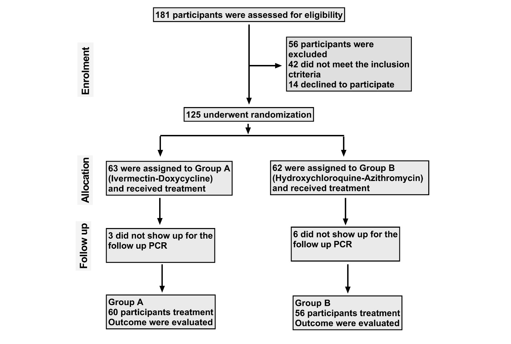

Doxycycline
==============

.. contents::
  :local:

  
  doxycycline capsules

Doxycycline is a broad-spectrum tetracycline-class antibiotic used in the treatment of infections caused by bacteria and certain parasites.[1] It is used to treat bacterial pneumonia, acne, chlamydia infections, Lyme disease, cholera, typhus, and syphilis.[1] It is also used to prevent malaria and in combination with quinine, to treat malaria.[1] Doxycycline may be taken by mouth or by injection into a vein.[1]

Common side effects include diarrhea, nausea, vomiting, and an increased risk of sunburn.[1] Use after the first trimester of pregnancy or in young children may result in permanent discoloration of the teeth.[1] Its use during breastfeeding is probably safe.[1] Doxycycline is a broad-spectrum antibiotic, of the tetracycline class.[1] Like other agents of this class, it either slows or kills bacteria by inhibiting protein production.[1][2] It kills malaria by targeting a plastid organelle, the apicoplast.[3][4]

Doxycycline was patented in 1957 and came into commercial use in 1967.[5][6] It is on the World Health Organization's List of Essential Medicines.[7] Doxycycline is available as a generic medicine.[1][8] In 2017, it was the 113th most commonly prescribed medication in the United States, with more than six million prescriptions.[9][10] It is available in India under the brand name DOXY-1- LDR.[11]

Source: https://en.wikipedia.org/wiki/Doxycycline  

  
  doxycycline-study

  
  doxycycline for STIs

  
  doxycycline-on-the-cell-viability

Page Generated: |today|