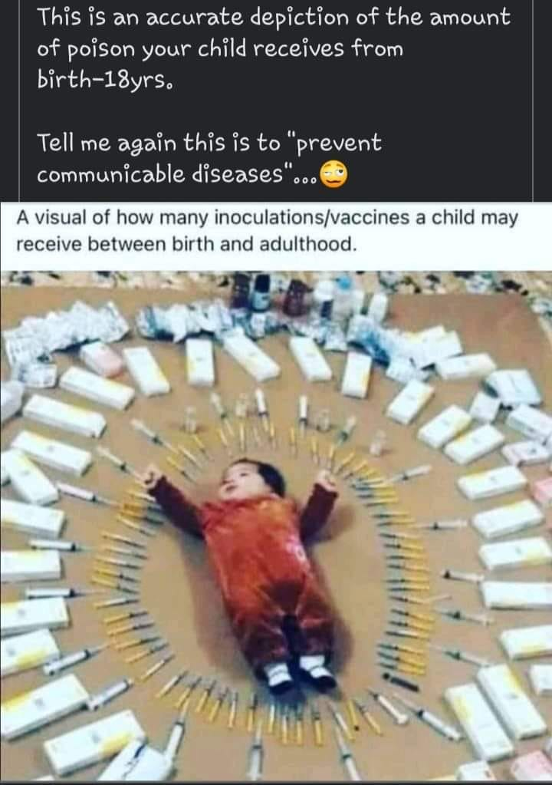

Facebook Kim Jong Bong Vaccine Recommendations Australia
============================================================

.. contents::
    :local:
  

    
    typical vaccines for an infant  

    Typical vaccines for an infant     
    
    So I’m wondering what vaccinations would you say my baby should definitely get and which ones are total BS

Brittney Sarkela shared her first post.
------------------------------------------

March 9 2021

https://www.facebook.com/groups/352030272864394/user/27215176/

https://www.facebook.com/groups/352030272864394/?multi_permalinks=503957121005041&notif_id=1615236370309915&notif_t=group_highlights&ref=notif

8 Month old no - zero vaccinations yet
------------------------------------------

Hi all! I’ve got an 8 month old who hasn’t had any vaccinations yet. 

Like probably most of you in this group I’ve seen so many arguments for both pro and anti.

So I’m wondering what vaccinations would you say my baby should definitely get and which ones are total BS.

I know that some have to be done before 9 months which is the reason for my post 

Thanks!

Response is by Kim Jong Bong
-----------------------------

https://www.facebook.com/groups/352030272864394/user/100063691026743/

Hep b
------------------------------------------

**Hep b** is transmitted blood to blood- usually injecting drugs or anal sex. Your 8 month old doing that?

Tetanus
------------------------------------------

**Tetanus** - extremely rare, 30 cases per year and 2 deaths in America. That's a 1 in 11,000,000 chance of catching it and 1 in 150,000,000 chance of dying from it. If your kid was to get an injury serious enough to catch it they'll be given a tetanus IG dose anyway. The vaccine isn't perfect, since 2009 25% of tetanus cases were in people who had 3 or more doses of tetanus toxoid containing vaccines and the remaining 75% were either unvaccinated or had received fewer than 3 doses of tetanus toxoid.

Mumps
------------------------------------------

**Mumps** isn't life threating, according to the CDC most people get very mild symptoms (like a cold), or no symptoms at all and may not know they have the disease. The vaccine is useless. It doesn't stop you getting mumps. The CDC says experts aren’t sure why vaccinated people still get mumps "it could be that their immune system didn’t respond as well as it should have to the vaccine"

Measles
------------------------------------------

**Measles** isn't dangerous unless you're deficient in vitamin A. In the 60's before vaccination and readily accessible health care, the CDC says almost everyone caught measles before turning 15, there was 3-4 million cases each year but only 400 deaths. Now because of better sanitation and nutrition as well as better treatments and access to health care here in Australia there hasn't been a death from measles since 1995. You might say vaccination was to thank for this, but in the 30 years between the 1920's and the 1950's measles deaths dropped from 6000 down to 400, if you follow that trend for the next 70 yrs to now maybe the vaccine got more credit than it deserves.

The Flu
------------------------------------------

**The flu** vaccine is usually around 30-40% effective at reducing symptoms of the stains it covers, and quite often they miss the prevalent strains. Check out how they determine those percentages too..really fudging numbers.

Whooping Cough
------------------------------------------

**Whooping cough** is for most people a mild illness. Most people who get it don't even know they've got it. It's not deadly for people older than 6 months. The vaccine doesn't stop you becoming infected. 95% of whooping cough cases in California in 2018 were in fully vaccinated people

Meningitis / Meningococcal
------------------------------------------

**Meningitis/meningococcal** usually only found in close quarter living (schools, colleges, military. It is spread by saliva-saliva contact e.g kissing/sharing a toothbrush. Currently, there is only vaccines for 4 of the 13 strains of meningitis, and unless you get it every 5 year it provides no protection.

Diptheria and Polio
------------------------------------------

**Diptheria** and **polio** don't exist in Australia, so there's no point getting them.

Heart Disease
------------------------------------------

**Heart disease** kills 17.9 million people per year, feed your kid good food and keep them exercising, probably more important
