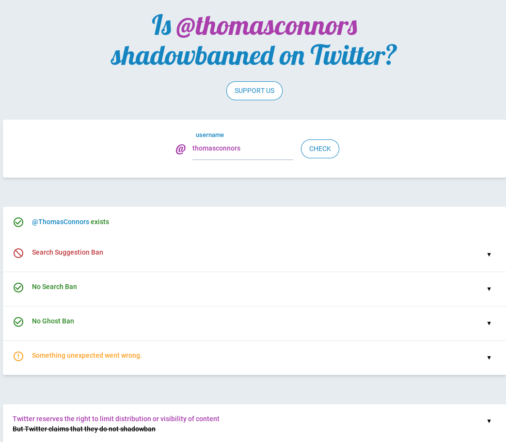

Government Monitoring and Control  
=======================================================================================

.. contents::
  :local:

What is narrative control and how is it used to shape public opinion  
------------------------------------------------------------------------------

Social Media    
------------------------------------------------------------------------------

How to understand the ways Facebook filters, throttles and amplifies communications     
--------------------------------------------------------------------------------------

How to understand the ways Twitter filters, throttles and amplifies communications     
-------------------------------------------------------------------------------------

When I posted this:

  
  brookline-economic-development-GIS-public-health-storefronts

I am constantly shadowbanned on Twitter

  
  Twitter Shadowban Example 

How to understand the ways Reddit filters, throttles and amplifies communications     
-----------------------------------------------------------------------------------

Person, identity, and location tracking  
------------------------------------------------------------------------------

How does ad tracking and cookies work across the web     
------------------------------------------------------------------------------

What are the all-encompassing data vacuums by Palantir and Oracle and Cambridge Analytica  
-------------------------------------------------------------------------------------------

What is the Palantir dashboard and who in your local area is viewing it  
------------------------------------------------------------------------------

What was Cambridge Analytica - what is that whole scandal about?     
------------------------------------------------------------------------------

Current Events and their relationship to today's events  
=======================================================================================

How to recognize typical Russian sabotage, cause confusion (Brexit etc)     
------------------------------------------------------------------------------

How to understand Brexit     
------------------------------------------------------------------------------

How to understand the Yellow Vests in France     
------------------------------------------------------------------------------

How understand the anti-fracking and pipeline protests by young people and indigenous peoples     
-------------------------------------------------------------------------------------------------

How to understand NAFTA North American Free Trade Agreement and fossil fuel's effect on sustainable Mexican agriculture     
--------------------------------------------------------------------------------------------------------------------------

Economics, Fossil Fuels, Pharma, Money, Power  
--------------------------------------------------------------------------------------------------------------------------

What are the economic effects of lockdowns    
------------------------------------------------------------------------------

How does the lockdowns help and encourage large business but destroy small business    
-------------------------------------------------------------------------------------

Here is a question I posted on Facebook, and also on Twitter

  
  brookline-economic-development-GIS-public-health-storefronts

Last change: |today|
