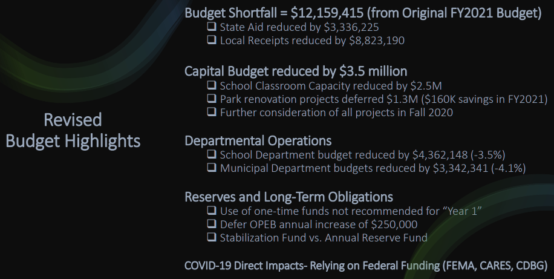
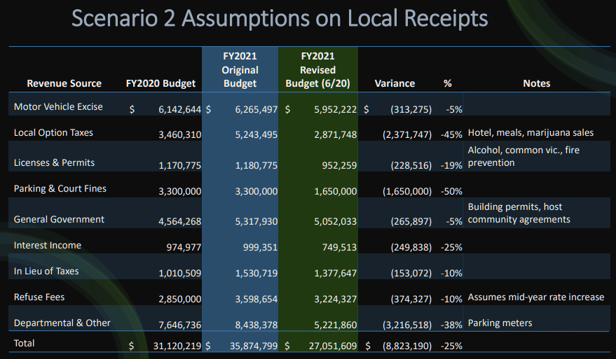
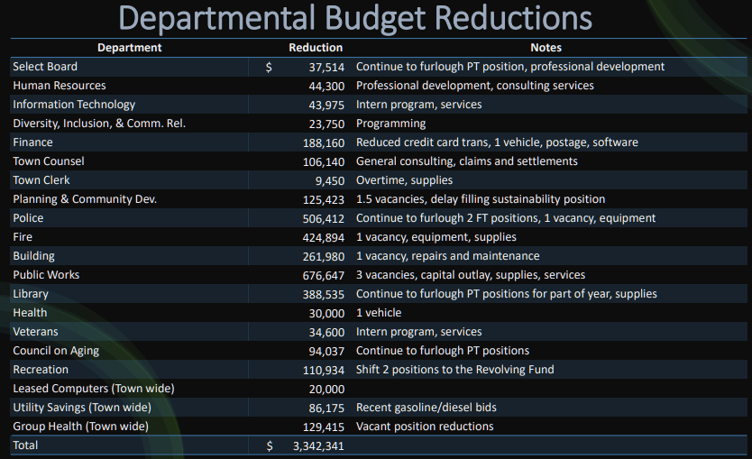
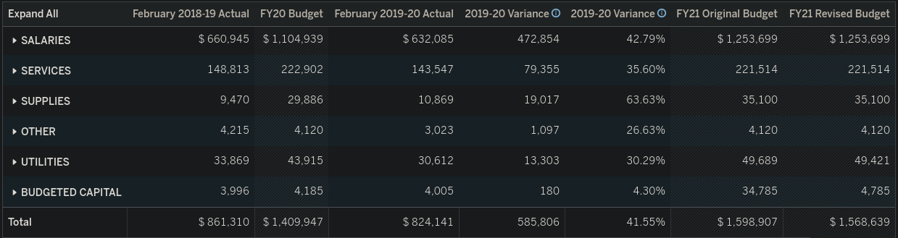
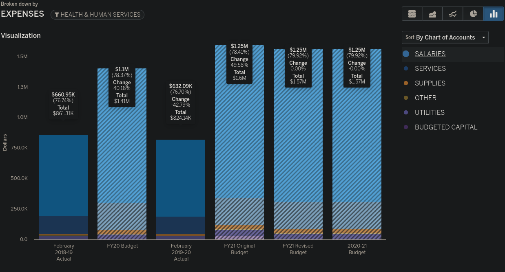

Letter to the town of Brookine Massachusetts
=============================================

.. contents::
  :local:

FY2021 Revised Budget: revised budget highlights  
-------------------------------------------------

  
  FY2021-revised-budget-revised-budget-highlights

Source: [FY 2021 Revised Budget Presentation to the Select Board](https://www.brooklinema.gov/DocumentCenter/View/21900/Revised-FY2021-Budet-Presentation-to-the-Select-Board-June-2-2020?bidId=)

FY2021 Revised Budget: assumptions local receipts  
-------------------------------------------------

  
  FY2021-revised-budget-assumptions-local-receipts

FY2021 Revised Budget: Departmental Reductions  
-------------------------------------------------

  
  FY2021-revised-budget-dept-reductions

Brookline Health: Budget 2018-2021  
-------------------------------------------------

Brookline subdirectory

  
  Brookline-Health-Budget-2018-2021

Source: [Financial Plan - Live Tracking](https://brooklinema.opengov.com/transparency/42952/accountType=expenses&embed=n&breakdown=types&currentYearAmount=cumulative&currentYearPeriod=years&graph=bar&legendSort=coa&month=2&proration=false&saved_view=141455&selection=48FF762B5E4BCEF083F472B45A84F80F&projections=null&projectionType=null&highlighting=null&highlightingVariance=null&year=2020&selectedDataSetIndex=null&fiscal_start=earliest&fiscal_end=latest)

Brookline Health: Salaries 2018-2021  
-------------------------------------------------

  
  Brookline-Health-Salaries-2018-2021

Public Health Department
-------------------------
  
How many staff  
------------------------------------------------------------------------------
  
Total Spending  
------------------------------------------------------------------------------
  
Activities Performed  
------------------------------------------------------------------------------
  
Same for Economic Development Department  
------------------------------------------------------------------------------
  

Last change: |today|
