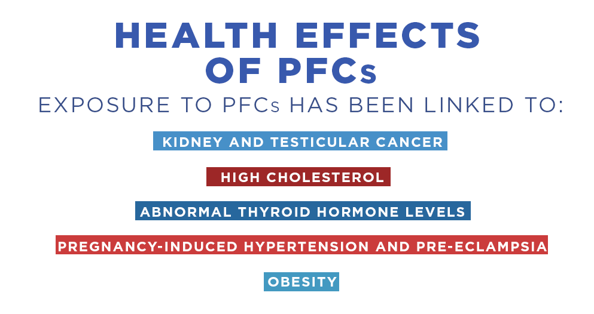

Many Fast Food Wrappers Still Coated in PFCs, Kin to Carcinogenic Teflon Chemical
-----------------------------------------------------------------------------------

.. contents::
  :local:

https://www.ewg.org/research/many-fast-food-wrappers-still-coated-pfcs-kin-carcinogenic-teflon-chemical

WEDNESDAY, FEBRUARY 1, 2017
By Dave Andrews, Senior Scientist, and Bill Walker, Managing Editor

More than a decade since the health hazards of perfluroinated chemicals, or PFCs, became known, many fast food chains still use food wrappers, bags and boxes coated with the grease-resistant compounds, according to nationwide tests reported in a new peer-reviewed study.[*] Some of the test samples detected traces of a notorious PFC, formerly used to make DuPont's Teflon, that was taken off the market after it was linked to cancer, and reproductive and developmental harm. 

Scientists from nonprofit research organizations including EWG, federal and state regulatory agencies and academic institutions[†] collaborated to test samples of sandwich and pastry wrappers, french fry bags, pizza boxes, and other paper and paperboard from 27 fast food chains and several local restaurants in five regions of the U.S. They found that of the 327 samples used to serve food, collected in 2014 and 2015, 40 percent tested positive for fluorine.

.. figure:: assets/EWG_PFC_Definition_02.webp
  :width: 80 %
  :alt:  Ivermectin-sheep-drench

What is a PFC

The presence of fluorine does not automatically indicate the presence of PFCs. But authors of the study include an Environmental Protection Agency expert who, in further tests of a smaller number of samples, found that the vast majority of materials he tested contained known PFCs. He also found that some samples showed traces of the former Teflon chemical PFOA, which, the most current research shows, is harmful at extraordinarily small doses.

PFOA is a type of PFC the Food and Drug Administration has banned from food contact papers, while continuing to allow the use of newer chemicals with a slightly different chemical structure. Manufacturers claim the next-generation chemicals are less hazardous because they are built on a chain of six or fewer carbon atoms rather than eight, so they pass from the human body faster. But manufacturers lack evidence that they are really much, if at all, safer.

The FDA has approved 20 next-generation PFCs specifically for coating paper and paperboard used to serve food. These chemicals have not been adequately tested for safety, and trade secrecy laws mean that, in some cases, the limited safety data submitted to the EPA does not publicly disclose the identity of the specific chemicals or even the companies submitting them for approval. But what little information manufacturers have provided to regulators is troubling.

In documents filed with the EPA, DuPont reported that a next-generation chemical used to produce food contact paper, called GenX, could pose a “substantial risk of injury,” including cancerous tumors in the pancreas and testicles, liver damage, kidney disease and reproductive harm.[1] In an investigation by the nonprofit news site The Intercept, retired EPA toxicologist and senior risk assessor Deborah Rice said GenX has "the same constellation of [health] effects you see with PFOA. There's no way you can call this a safe substitute."[2]

Health Effects of PFCs: Exposure to PFCs has been linked to kidney and testicular cancer, high cholesterol, abnormal thyroid hormone levels, pregnancy-induced hypertension and pre-eclampsia, obesity

PFC-free paper is readily available, as shown by the fact that the tests detected no fluorine in more than half of the paper samples. Depending on location, individual fast food restaurants or regional franchise groups in the same chain may get their wrappers and containers from different suppliers. So parent corporations may not know if outlets are using PFC-coated paper or if suppliers are accurately disclosing whether their paper contains such chemicals.

It is possible that some of the papers that tested positive were not intentionally coated with the chemicals, but were made partly from recycled paper with PFCs. The paper with traces of the banned chemical, PFOA, may have been contaminated during manufacturing or by contact with other materials coated with the compound, which was used to make many consumer and industrial products. PFOA is no longer made in the U.S., but production continues apace in China.

 
TELL THE FDA: BAN PFAS CHEMICALS IN FOOD WRAPPERS
Are you ready to take the next step? Join EWG and tell the Food and Drug Administration that it's time to ban toxic PFAS chemicals from use in food wrappers. Enter your information below and we'll add your name to EWG's petition urging the FDA to take action.

Last change: |today|