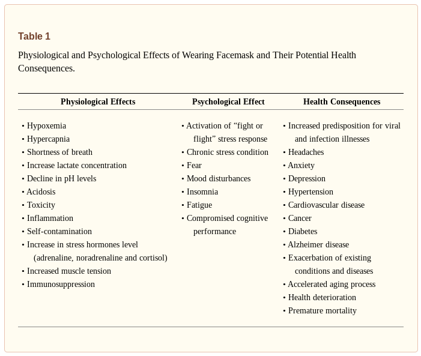

Masks - What Are They For? 
====================================

.. toctree::
   :maxdepth: 2
   :caption: Contents:

   masks-are-ineffective-to-halt-transmission-of-viral-and-infectious-disease-such-SARS-CoV-2-and-COVID-19

   
.. contents::
    :local:

  
  Physiological and Psychological Effects of Wearing Facemask and Their Potential Health Consequences.

  The data suggest that both medical and non-medical facemasks are ineffective to block human-to-human transmission of viral and infectious disease such SARS-CoV-2 and COVID-19, supporting against the usage of facemasks.

  Source NIH NCBI, By Baruch Vainshelboim PMCID: PMC7680614 https://www.ncbi.nlm.nih.gov/pmc/articles/PMC7680614/?fbclid=IwAR2e_lF94uwKtX8NM8mNAMpfCmLVi4v1DBeXFtXTZJAOMh1WeBYvJI8Y6KQ

Last change: |today|