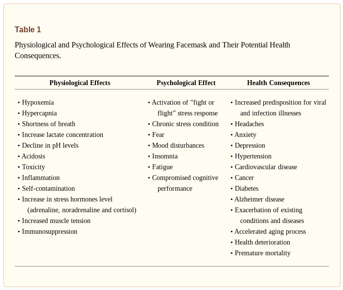

NIH: Masks are ineffective to prevent transmission of viral and infectious disease such SARS-CoV-2 and COVID-19
=====================================================================================================================

.. Note:: 
    
    This page was Retrieved and copied April 19 2021
    
    URL https://www.ncbi.nlm.nih.gov/pmc/articles/PMC7680614/?fbclid=IwAR2e_lF94uwKtX8NM8mNAMpfCmLVi4v1DBeXFtXTZJAOMh1WeBYvJI8Y6KQ

.. toctree::
   :maxdepth: 2
   :caption: Contents:

   
.. contents::
    :local:

Journal List -> Elsevier Public Health Emergency Collection -> PMC7680614

PMC7680614

Med Hypotheses. 2021 Jan; 146: 110411.

Published online 2020 Nov 22. doi: 10.1016/j.mehy.2020.110411

PMCID: PMC7680614

PMID: 33303303

Title: Facemasks in the COVID-19 era: A health hypothesis

Baruch Vainshelboim⁎

https://www.ncbi.nlm.nih.gov/pmc/articles/PMC7680614/?fbclid=IwAR2e_lF94uwKtX8NM8mNAMpfCmLVi4v1DBeXFtXTZJAOMh1WeBYvJI8Y6KQ

Author information Article notes Copyright and License information Disclaimer

Abstract
-------------------

Many countries across the globe utilized medical and non-medical facemasks as non-pharmaceutical intervention for reducing the transmission and infectivity of coronavirus disease-2019 (COVID-19). Although, scientific evidence supporting facemasks’ efficacy is lacking, adverse physiological, psychological and health effects are established. Is has been hypothesized that facemasks have compromised safety and efficacy profile and should be avoided from use. The current article comprehensively summarizes scientific evidences with respect to wearing facemasks in the COVID-19 era, providing prosper information for public health and decisions making.

Keywords: Physiology, Psychology, Health, SARS-CoV-2, Safety, Efficacy

Introduction
-------------------

Facemasks are part of non-pharmaceutical interventions providing some breathing barrier to the mouth and nose that have been utilized for reducing the transmission of respiratory pathogens [1]. Facemasks can be medical and non-medical, where two types of the medical masks primarily used by healthcare workers [1], [2]. The first type is National Institute for Occupational Safety and Health (NIOSH)-certified N95 mask, a filtering face-piece respirator, and the second type is a surgical mask [1]. The designed and intended uses of N95 and surgical masks are different in the type of protection they potentially provide. The N95s are typically composed of electret filter media and seal tightly to the face of the wearer, whereas surgical masks are generally loose fitting and may or may not contain electret-filtering media. The N95s are designed to reduce the wearer’s inhalation exposure to infectious and harmful particles from the environment such as during extermination of insects. In contrast, surgical masks are designed to provide a barrier protection against splash, spittle and other body fluids to spray from the wearer (such as surgeon) to the sterile environment (patient during operation) for reducing the risk of contamination [1].

The third type of facemasks are the non-medical cloth or fabric masks. The non-medical facemasks are made from a variety of woven and non-woven materials such as Polypropylene, Cotton, Polyester, Cellulose, Gauze and Silk. Although non-medical cloth or fabric facemasks are neither a medical device nor personal protective equipment, some standards have been developed by the French Standardization Association (AFNOR Group) to define a minimum performance for filtration and breathability capacity [2]. The current article reviews the scientific evidences with respect to safety and efficacy of wearing facemasks, describing the physiological and psychological effects and the potential long-term consequences on health.

Hypothesis
--------------------------------------------

On January 30, 2020, the World Health Organization (WHO) announced a global public health emergency of severe acute respiratory syndrome-coronavirus-2 (SARS-CoV-2) causing illness of coronavirus disease-2019 (COVID-19) [3]. As of October 1, 2020, worldwide 34,166,633 cases were reported and 1,018,876 have died with virus diagnosis. Interestingly, 99% of the detected cases with SARS-CoV-2 are asymptomatic or have mild condition, which contradicts with the virus name (severe acute respiratory syndrome-coronavirus-2) [4]. Although infection fatality rate (number of death cases divided by number of reported cases) initially seems quite high 0.029 (2.9%) [4], this overestimation related to limited number of COVID-19 tests performed which biases towards higher rates. Given the fact that asymptomatic or minimally symptomatic cases is several times higher than the number of reported cases, the case fatality rate is considerably less than 1% [5]. This was confirmed by the head of National Institute of Allergy and Infectious Diseases from US stating, “the overall clinical consequences of COVID-19 are similar to those of severe seasonal influenza” [5], having a case fatality rate of approximately 0.1% [5], [6], [7], [8]. In addition, data from hospitalized patients with COVID-19 and general public indicate that the majority of deaths were among older and chronically ill individuals, supporting the possibility that the virus may exacerbates existing conditions but rarely causes death by itself [9], [10]. SARS-CoV-2 primarily affects respiratory system and can cause complications such as acute respiratory distress syndrome (ARDS), respiratory failure and death [3], [9]. It is not clear however, what the scientific and clinical basis for wearing facemasks as protective strategy, given the fact that facemasks restrict breathing, causing hypoxemia and hypercapnia and increase the risk for respiratory complications, self-contamination and exacerbation of existing chronic conditions [2], [11], [12], [13], [14].

Of note, hyperoxia or oxygen supplementation (breathing air with high partial O2 pressures that above the sea levels) has been well established as therapeutic and curative practice for variety acute and chronic conditions including respiratory complications [11], [15]. It fact, the current standard of care practice for treating hospitalized patients with COVID-19 is breathing 100% oxygen [16], [17], [18]. Although several countries mandated wearing facemask in health care settings and public areas, scientific evidences are lacking supporting their efficacy for reducing morbidity or mortality associated with infectious or viral diseases [2], [14], [19]. Therefore, it has been hypothesized: 1) the practice of wearing facemasks has compromised safety and efficacy profile, 2) Both medical and non-medical facemasks are ineffective to reduce human-to-human transmission and infectivity of SARS-CoV-2 and COVID-19, 3) Wearing facemasks has adverse physiological and psychological effects, 4) Long-term consequences of wearing facemasks on health are detrimental.

Evolution of hypothesis
--------------------------------------------

Breathing Physiology
--------------------------------------------

Breathing is one of the most important physiological functions to sustain life and health. Human body requires a continuous and adequate oxygen (O2) supply to all organs and cells for normal function and survival. Breathing is also an essential process for removing metabolic byproducts [carbon dioxide (CO2)] occurring during cell respiration [12], [13]. It is well established that acute significant deficit in O2 (hypoxemia) and increased levels of CO2 (hypercapnia) even for few minutes can be severely harmful and lethal, while chronic hypoxemia and hypercapnia cause health deterioration, exacerbation of existing conditions, morbidity and ultimately mortality [11], [20], [21], [22]. Emergency medicine demonstrates that 5–6 min of severe hypoxemia during cardiac arrest will cause brain death with extremely poor survival rates [20], [21], [22], [23]. On the other hand, chronic mild or moderate hypoxemia and hypercapnia such as from wearing facemasks resulting in shifting to higher contribution of anaerobic energy metabolism, decrease in pH levels and increase in cells and blood acidity, toxicity, oxidative stress, chronic inflammation, immunosuppression and health deterioration [24], [11], [12], [13].

Efficacy of facemasks
--------------------------------------------

The physical properties of medical and non-medical facemasks suggest that facemasks are ineffective to block viral particles due to their difference in scales [16], [17], [25]. According to the current knowledge, the virus SARS-CoV-2 has a diameter of 60 nm to 140 nm [nanometers (billionth of a meter)] [16], [17], while medical and non-medical facemasks’ thread diameter ranges from 55 µm to 440 µm [micrometers (one millionth of a meter), which is more than 1000 times larger [25]. Due to the difference in sizes between SARS-CoV-2 diameter and facemasks thread diameter (the virus is 1000 times smaller), SARS-CoV-2 can easily pass through any facemask [25]. In addition, the efficiency filtration rate of facemasks is poor, ranging from 0.7% in non-surgical, cotton-gauze woven mask to 26% in cotton sweeter material [2]. With respect to surgical and N95 medical facemasks, the efficiency filtration rate falls to 15% and 58%, respectively when even small gap between the mask and the face exists [25].

Clinical scientific evidence challenges further the efficacy of facemasks to block human-to-human transmission or infectivity. A randomized controlled trial (RCT) of 246 participants [123 (50%) symptomatic)] who were allocated to either wearing or not wearing surgical facemask, assessing viruses transmission including coronavirus [26]. The results of this study showed that among symptomatic individuals (those with fever, cough, sore throat, runny nose ect…) there was no difference between wearing and not wearing facemask for coronavirus droplets transmission of particles of >5 µm. Among asymptomatic individuals, there was no droplets or aerosols coronavirus detected from any participant with or without the mask, suggesting that asymptomatic individuals do not transmit or infect other people [26]. This was further supported by a study on infectivity where 445 asymptomatic individuals were exposed to asymptomatic SARS-CoV-2 carrier (been positive for SARS-CoV-2) using close contact (shared quarantine space) for a median of 4 to 5 days. The study found that none of the 445 individuals was infected with SARS-CoV-2 confirmed by real-time reverse transcription polymerase [27].

A meta-analysis among health care workers found that compared to no masks, surgical mask and N95 respirators were not effective against transmission of viral infections or influenza-like illness based on six RCTs [28]. Using separate analysis of 23 observational studies, this meta-analysis found no protective effect of medical mask or N95 respirators against SARS virus [28]. A recent systematic review of 39 studies including 33,867 participants in community settings (self-report illness), found no difference between N95 respirators versus surgical masks and surgical mask versus no masks in the risk for developing influenza or influenza-like illness, suggesting their ineffectiveness of blocking viral transmissions in community settings [29].

Another meta-analysis of 44 non-RCT studies (n = 25,697 participants) examining the potential risk reduction of facemasks against SARS, middle east respiratory syndrome (MERS) and COVID-19 transmissions [30]. The meta-analysis included four specific studies on COVID-19 transmission (5,929 participants, primarily health-care workers used N95 masks). Although the overall findings showed reduced risk of virus transmission with facemasks, the analysis had severe limitations to draw conclusions. One of the four COVID-19 studies had zero infected cases in both arms, and was excluded from meta-analytic calculation. Other two COVID-19 studies had unadjusted models, and were also excluded from the overall analysis. The meta-analytic results were based on only one COVID-19, one MERS and 8 SARS studies, resulting in high selection bias of the studies and contamination of the results between different viruses. Based on four COVID-19 studies, the meta-analysis failed to demonstrate risk reduction of facemasks for COVID-19 transmission, where the authors reported that the results of meta-analysis have low certainty and are inconclusive [30].

In early publication the WHO stated that “facemasks are not required, as no evidence is available on its usefulness to protect non-sick persons” [14]. In the same publication, the WHO declared that “cloth (e.g. cotton or gauze) masks are not recommended under any circumstance” [14]. Conversely, in later publication the WHO stated that the usage of fabric-made facemasks (Polypropylene, Cotton, Polyester, Cellulose, Gauze and Silk) is a general community practice for “preventing the infected wearer transmitting the virus to others and/or to offer protection to the healthy wearer against infection (prevention)” [2]. The same publication further conflicted itself by stating that due to the lower filtration, breathability and overall performance of fabric facemasks, the usage of woven fabric mask such as cloth, and/or non-woven fabrics, should only be considered for infected persons and not for prevention practice in asymptomatic individuals [2]. The Central for Disease Control and Prevention (CDC) made similar recommendation, stating that only symptomatic persons should consider wearing facemask, while for asymptomatic individuals this practice is not recommended [31]. Consistent with the CDC, clinical scientists from Departments of Infectious Diseases and Microbiology in Australia counsel against facemasks usage for health-care workers, arguing that there is no justification for such practice while normal caring relationship between patients and medical staff could be compromised [32]. Moreover, the WHO repeatedly announced that “at present, there is no direct evidence (from studies on COVID-19) on the effectiveness face masking of healthy people in the community to prevent infection of respiratory viruses, including COVID-19”[2]. Despite these controversies, the potential harms and risks of wearing facemasks were clearly acknowledged. These including self-contamination due to hand practice or non-replaced when the mask is wet, soiled or damaged, development of facial skin lesions, irritant dermatitis or worsening acne and psychological discomfort. Vulnerable populations such as people with mental health disorders, developmental disabilities, hearing problems, those living in hot and humid environments, children and patients with respiratory conditions are at significant health risk for complications and harm [2].

Physiological effects of wearing facemasks
--------------------------------------------

Wearing facemask mechanically restricts breathing by increasing the resistance of air movement during both inhalation and exhalation process [12], [13]. Although, intermittent (several times a week) and repetitive (10–15 breaths for 2–4 sets) increase in respiration resistance may be adaptive for strengthening respiratory muscles [33], [34], prolonged and continues effect of wearing facemask is maladaptive and could be detrimental for health [11], [12], [13]. In normal conditions at the sea level, air contains 20.93% O2 and 0.03% CO2, providing partial pressures of 100 mmHg and 40 mmHg for these gases in the arterial blood, respectively. These gas concentrations significantly altered when breathing occurs through facemask. A trapped air remaining between the mouth, nose and the facemask is rebreathed repeatedly in and out of the body, containing low O2 and high CO2 concentrations, causing hypoxemia and hypercapnia [35], [36], [11], [12], [13]. Severe hypoxemia may also provoke cardiopulmonary and neurological complications and is considered an important clinical sign in cardiopulmonary medicine [37], [38], [39], [40], [41], [42]. Low oxygen content in the arterial blood can cause myocardial ischemia, serious arrhythmias, right or left ventricular dysfunction, dizziness, hypotension, syncope and pulmonary hypertension [43]. Chronic low-grade hypoxemia and hypercapnia as result of using facemask can cause exacerbation of existing cardiopulmonary, metabolic, vascular and neurological conditions [37], [38], [39], [40], [41], [42]. Table 1 summarizes the physiological, psychological effects of wearing facemask and their potential long-term consequences for health.

Table 1
--------------------------------------------

Physiological and Psychological Effects of Wearing Facemask and Their Potential Health Consequences.

Physiological Effects	Psychological Effect	Health Consequences
• Hypoxemia
• Hypercapnia
• Shortness of breath
• Increase lactate concentration
• Decline in pH levels
• Acidosis
• Toxicity
• Inflammation
• Self-contamination
• Increase in stress hormones level (adrenaline, noradrenaline and cortisol)
• Increased muscle tension
• Immunosuppression
• Activation of “fight or flight” stress response
• Chronic stress condition
• Fear
• Mood disturbances
• Insomnia
• Fatigue
• Compromised cognitive performance
• Increased predisposition for viral and infection illnesses
• Headaches
• Anxiety
• Depression
• Hypertension
• Cardiovascular disease
• Cancer
• Diabetes
• Alzheimer disease
• Exacerbation of existing conditions and diseases
• Accelerated aging process
• Health deterioration
• Premature mortality

  
  Physiological and Psychological Effects of Wearing Facemask and Their Potential Health Consequences.

  The data suggest that both medical and non-medical facemasks are ineffective to block human-to-human transmission of viral and infectious disease such SARS-CoV-2 and COVID-19, supporting against the usage of facemasks.

  Source NIH NCBI, By Baruch Vainshelboim PMCID: PMC7680614 https://www.ncbi.nlm.nih.gov/pmc/articles/PMC7680614/?fbclid=IwAR2e_lF94uwKtX8NM8mNAMpfCmLVi4v1DBeXFtXTZJAOMh1WeBYvJI8Y6KQ

In addition to hypoxia and hypercapnia, breathing through facemask residues bacterial and germs components on the inner and outside layer of the facemask. These toxic components are repeatedly rebreathed back into the body, causing self-contamination. Breathing through facemasks also increases temperature and humidity in the space between the mouth and the mask, resulting a release of toxic particles from the mask’s materials [1], [2], [19], [26], [35], [36]. A systematic literature review estimated that aerosol contamination levels of facemasks including 13 to 202,549 different viruses [1]. Rebreathing contaminated air with high bacterial and toxic particle concentrations along with low O2 and high CO2 levels continuously challenge the body homeostasis, causing self-toxicity and immunosuppression [1], [2], [19], [26], [35], [36].

A study on 39 patients with renal disease found that wearing N95 facemask during hemodialysis significantly reduced arterial partial oxygen pressure (from PaO2 101.7 to 92.7 mm Hg), increased respiratory rate (from 16.8 to 18.8 breaths/min), and increased the occurrence of chest discomfort and respiratory distress [35]. Respiratory Protection Standards from Occupational Safety and Health Administration, US Department of Labor states that breathing air with O2 concentration below 19.5% is considered oxygen-deficiency, causing physiological and health adverse effects. These include increased breathing frequency, accelerated heartrate and cognitive impairments related to thinking and coordination [36]. A chronic state of mild hypoxia and hypercapnia has been shown as primarily mechanism for developing cognitive dysfunction based on animal studies and studies in patients with chronic obstructive pulmonary disease [44].

The adverse physiological effects were confirmed in a study of 53 surgeons where surgical facemask were used during a major operation. After 60 min of facemask wearing the oxygen saturation dropped by more than 1% and heart rate increased by approximately five beats/min [45]. Another study among 158 health-care workers using protective personal equipment primarily N95 facemasks reported that 81% (128 workers) developed new headaches during their work shifts as these become mandatory due to COVID-19 outbreak. For those who used the N95 facemask greater than 4 h per day, the likelihood for developing a headache during the work shift was approximately four times higher [Odds ratio = 3.91, 95% CI (1.35–11.31) p = 0.012], while 82.2% of the N95 wearers developed the headache already within ≤10 to 50 min [46].

With respect to cloth facemask, a RCT using four weeks follow up compared the effect of cloth facemask to medical masks and to no masks on the incidence of clinical respiratory illness, influenza-like illness and laboratory-confirmed respiratory virus infections among 1607 participants from 14 hospitals [19]. The results showed that there were no difference between wearing cloth masks, medical masks and no masks for incidence of clinical respiratory illness and laboratory-confirmed respiratory virus infections. However, a large harmful effect with more than 13 times higher risk [Relative Risk = 13.25 95% CI (1.74 to 100.97) was observed for influenza-like illness among those who were wearing cloth masks [19]. The study concluded that cloth masks have significant health and safety issues including moisture retention, reuse, poor filtration and increased risk for infection, providing recommendation against the use of cloth masks [19].

Psychological effects of wearing facemasks
--------------------------------------------

Psychologically, wearing facemask fundamentally has negative effects on the wearer and the nearby person. Basic human-to-human connectivity through face expression is compromised and self-identity is somewhat eliminated [47], [48], [49]. These dehumanizing movements partially delete the uniqueness and individuality of person who wearing the facemask as well as the connected person [49]. Social connections and relationships are basic human needs, which innately inherited in all people, whereas reduced human-to-human connections are associated with poor mental and physical health [50], [51]. Despite escalation in technology and globalization that would presumably foster social connections, scientific findings show that people are becoming increasingly more socially isolated, and the prevalence of loneliness is increasing in last few decades [50], [52]. Poor social connections are closely related to isolation and loneliness, considered significant health related risk factors [50], [51], [52], [53].

A meta-analysis of 91 studies of about 400,000 people showed a 13% increased morality risk among people with low compare to high contact frequency [53]. Another meta-analysis of 148 prospective studies (308,849 participants) found that poor social relationships was associated with 50% increased mortality risk. People who were socially isolated or fell lonely had 45% and 40% increased mortality risk, respectively. These findings were consistent across ages, sex, initial health status, cause of death and follow-up periods [52]. Importantly, the increased risk for mortality was found comparable to smoking and exceeding well-established risk factors such as obesity and physical inactivity [52]. An umbrella review of 40 systematic reviews including 10 meta-analyses demonstrated that compromised social relationships were associated with increased risk of all-cause mortality, depression, anxiety suicide, cancer and overall physical illness [51].

As described earlier, wearing facemasks causing hypoxic and hypercapnic state that constantly challenges the normal homeostasis, and activates “fight or flight” stress response, an important survival mechanism in the human body [11], [12], [13]. The acute stress response includes activation of nervous, endocrine, cardiovascular, and the immune systems [47], [54], [55], [56]. These include activation of the limbic part of the brain, release stress hormones (adrenalin, neuro-adrenalin and cortisol), changes in blood flow distribution (vasodilation of peripheral blood vessels and vasoconstriction of visceral blood vessels) and activation of the immune system response (secretion of macrophages and natural killer cells) [47], [48]. Encountering people who wearing facemasks activates innate stress-fear emotion, which is fundamental to all humans in danger or life threating situations, such as death or unknown, unpredictable outcome. While acute stress response (seconds to minutes) is adaptive reaction to challenges and part of the survival mechanism, chronic and prolonged state of stress-fear is maladaptive and has detrimental effects on physical and mental health. The repeatedly or continuously activated stress-fear response causes the body to operate on survival mode, having sustain increase in blood pressure, pro-inflammatory state and immunosuppression [47], [48].

Long-Term health consequences of wearing facemasks
--------------------------------------------------------

Long-term practice of wearing facemasks has strong potential for devastating health consequences. Prolonged hypoxic-hypercapnic state compromises normal physiological and psychological balance, deteriorating health and promotes the developing and progression of existing chronic diseases [23], [38], [39], [43], [47], [48], [57], [11], [12], [13]. For instance, ischemic heart disease caused by hypoxic damage to the myocardium is the most common form of cardiovascular disease and is a number one cause of death worldwide (44% of all non-communicable diseases) with 17.9 million deaths occurred in 2016 [57]. Hypoxia also playing an important role in cancer burden [58]. Cellular hypoxia has strong mechanistic feature in promoting cancer initiation, progression, metastasis, predicting clinical outcomes and usually presents a poorer survival in patients with cancer. Most solid tumors present some degree of hypoxia, which is independent predictor of more aggressive disease, resistance to cancer therapies and poorer clinical outcomes [59], [60]. Worth note, cancer is one of the leading causes of death worldwide, with an estimate of more than 18 million new diagnosed cases and 9.6 million cancer-related deaths occurred in 2018 [61].

With respect to mental health, global estimates showing that COVID-19 will cause a catastrophe due to collateral psychological damage such as quarantine, lockdowns, unemployment, economic collapse, social isolation, violence and suicides [62], [63], [64]. Chronic stress along with hypoxic and hypercapnic conditions knocks the body out of balance, and can cause headaches, fatigue, stomach issues, muscle tension, mood disturbances, insomnia and accelerated aging [47], [48], [65], [66], [67]. This state suppressing the immune system to protect the body from viruses and bacteria, decreasing cognitive function, promoting the developing and exacerbating the major health issues including hypertension, cardiovascular disease, diabetes, cancer, Alzheimer disease, rising anxiety and depression states, causes social isolation and loneliness and increasing the risk for prematurely mortality [47], [48], [51], [56], [66].

Conclusion
--------------------------------------------

The existing scientific evidences challenge the safety and efficacy of wearing facemask as preventive intervention for COVID-19. The data suggest that both medical and non-medical facemasks are ineffective to block human-to-human transmission of viral and infectious disease such SARS-CoV-2 and COVID-19, supporting against the usage of facemasks. Wearing facemasks has been demonstrated to have substantial adverse physiological and psychological effects. These include hypoxia, hypercapnia, shortness of breath, increased acidity and toxicity, activation of fear and stress response, rise in stress hormones, immunosuppression, fatigue, headaches, decline in cognitive performance, predisposition for viral and infectious illnesses, chronic stress, anxiety and depression. Long-term consequences of wearing facemask can cause health deterioration, developing and progression of chronic diseases and premature death. Governments, policy makers and health organizations should utilize prosper and scientific evidence-based approach with respect to wearing facemasks, when the latter is considered as preventive intervention for public health.

CRediT authorship contribution statement
--------------------------------------------

Baruch Vainshelboim: Conceptualization, Data curation, Writing - original draft.

Declaration of Competing Interest
--------------------------------------------

The authors declare that they have no known competing financial interests or personal relationships that could have appeared to influence the work reported in this paper.

References
--------------------------------------------

1. Fisher E.M., Noti J.D., Lindsley W.G., Blachere F.M., Shaffer R.E. Validation and application of models to predict facemask influenza contamination in healthcare settings. Risk Anal. 2014;34:1423–1434. [PMC free article] [PubMed] [Google Scholar]
2. World Health Organization. Advice on the use of masks in the context of COVID-19. Geneva, Switzerland; 2020.
3. Sohrabi C., Alsafi Z., O'Neill N., Khan M., Kerwan A., Al-Jabir A. World Health Organization declares global emergency: A review of the 2019 novel coronavirus (COVID-19) Int J Surg. 2020;76:71–76. [PMC free article] [PubMed] [Google Scholar]
4. Worldometer. COVID-19 CORONAVIRUS PANDEMIC. 2020.
5. Fauci A.S., Lane H.C., Redfield R.R. Covid-19 - Navigating the Uncharted. N Engl J Med. 2020;382:1268–1269. [PMC free article] [PubMed] [Google Scholar]
6. Shrestha S.S., Swerdlow D.L., Borse R.H., Prabhu V.S., Finelli L., Atkins C.Y. Estimating the burden of 2009 pandemic influenza A (H1N1) in the United States (April 2009-April 2010) Clin Infect Dis. 2011;52(Suppl 1):S75–S82. [PubMed] [Google Scholar]
7. Thompson W.W., Weintraub E., Dhankhar P., Cheng P.Y., Brammer L., Meltzer M.I. Estimates of US influenza-associated deaths made using four different methods. Influenza Other Respir Viruses. 2009;3:37–49. [PMC free article] [PubMed] [Google Scholar]
8. Centers for Disease, C., Prevention. Estimates of deaths associated with seasonal influenza --- United States, 1976-2007. MMWR Morb Mortal Wkly Rep. 2010,59:1057-62. [PubMed]
9. Richardson S., Hirsch J.S., Narasimhan M., Crawford J.M., McGinn T., Davidson K.W. Presenting Characteristics, Comorbidities, and Outcomes Among 5700 Patients Hospitalized With COVID-19 in the New York City Area. JAMA. 2020 [PMC free article] [PubMed] [Google Scholar]
10. Ioannidis J.P.A., Axfors C., Contopoulos-Ioannidis D.G. Population-level COVID-19 mortality risk for non-elderly individuals overall and for non-elderly individuals without underlying diseases in pandemic epicenters. Environ Res. 2020;188 [PMC free article] [PubMed] [Google Scholar]
11. American College of Sports Medicine . Sixth ed. Lippincott Wiliams & Wilkins; Baltimore: 2010. ACSM's Resource Manual for Guidelines for Exercise Testing and Priscription. [Google Scholar]
12. Farrell P.A., Joyner M.J., Caiozzo V.J. second edition. Lippncott Williams & Wilkins; Baltimore: 2012. ACSM's Advanced Exercise Physiology. [Google Scholar]
13. Kenney W.L., Wilmore J.H., Costill D.L. 5th ed. Human Kinetics; Champaign, IL: 2012. Physiology of sport and exercise. [Google Scholar]
14. World Health Organization. Advice on the use of masks in the community, during home care and in health care settings in the context of the novel coronavirus (2019-nCoV) outbreak. Geneva, Switzerland; 2020.
15. Sperlich B., Zinner C., Hauser A., Holmberg H.C., Wegrzyk J. The Impact of Hyperoxia on Human Performance and Recovery. Sports Med. 2017;47:429–438. [PubMed] [Google Scholar]
16. Wiersinga W.J., Rhodes A., Cheng A.C., Peacock S.J., Prescott H.C. Pathophysiology, Transmission, Diagnosis, and Treatment of Coronavirus Disease 2019 (COVID-19): A Review. JAMA. 2020 [PubMed] [Google Scholar]
17. Zhu N., Zhang D., Wang W., Li X., Yang B., Song J. A Novel Coronavirus from Patients with Pneumonia in China, 2019. N Engl J Med. 2020;382:727–733. [PMC free article] [PubMed] [Google Scholar]
18. Poston J.T., Patel B.K., Davis A.M. Management of Critically Ill Adults With COVID-19. JAMA. 2020 [PubMed] [Google Scholar]
19. MacIntyre C.R., Seale H., Dung T.C., Hien N.T., Nga P.T., Chughtai A.A. A cluster randomised trial of cloth masks compared with medical masks in healthcare workers. BMJ open. 2015;5 [PMC free article] [PubMed] [Google Scholar]
20. Patil K.D., Halperin H.R., Becker L.B. Cardiac arrest: resuscitation and reperfusion. Circ Res. 2015;116:2041–2049. [PMC free article] [PubMed] [Google Scholar]
21. Hazinski M.F., Nolan J.P., Billi J.E., Bottiger B.W., Bossaert L., de Caen A.R. Part 1: Executive summary: 2010 International Consensus on Cardiopulmonary Resuscitation and Emergency Cardiovascular Care Science With Treatment Recommendations. Circulation. 2010;122:S250–S275. [PubMed] [Google Scholar]
22. Kleinman M.E., Goldberger Z.D., Rea T., Swor R.A., Bobrow B.J., Brennan E.E. American Heart Association Focused Update on Adult Basic Life Support and Cardiopulmonary Resuscitation Quality: An Update to the American Heart Association Guidelines for Cardiopulmonary Resuscitation and Emergency Cardiovascular Care. Circulation. 2018;137:e7–e13. [PubMed] [Google Scholar]
23. Lurie K.G., Nemergut E.C., Yannopoulos D., Sweeney M. The Physiology of Cardiopulmonary Resuscitation. Anesth Analg. 2016;122:767–783. [PubMed] [Google Scholar]
24. Chandrasekaran B., Fernandes S. “Exercise with facemask; Are we handling a devil's sword?” - A physiological hypothesis. Med Hypotheses. 2020;144 [PMC free article] [PubMed] [Google Scholar]
25. Konda A., Prakash A., Moss G.A., Schmoldt M., Grant G.D., Guha S. Aerosol Filtration Efficiency of Common Fabrics Used in Respiratory Cloth Masks. ACS Nano. 2020;14:6339–6347. [PMC free article] [PubMed] [Google Scholar]
26. Leung N.H.L., Chu D.K.W., Shiu E.Y.C., Chan K.H., McDevitt J.J., Hau B.J.P. Respiratory virus shedding in exhaled breath and efficacy of face masks. Nat Med. 2020;26:676–680. [PubMed] [Google Scholar]
27. Gao M., Yang L., Chen X., Deng Y., Yang S., Xu H. A study on infectivity of asymptomatic SARS-CoV-2 carriers. Respir Med. 2020;169 [PMC free article] [PubMed] [Google Scholar]
28. Smith J.D., MacDougall C.C., Johnstone J., Copes R.A., Schwartz B., Garber G.E. Effectiveness of N95 respirators versus surgical masks in protecting health care workers from acute respiratory infection: a systematic review and meta-analysis. CMAJ. 2016;188:567–574. [PMC free article] [PubMed] [Google Scholar]
29. Chou R., Dana T., Jungbauer R., Weeks C., McDonagh M.S. Masks for Prevention of Respiratory Virus Infections, Including SARS-CoV-2, in Health Care and Community Settings: A Living Rapid Review. Ann Intern Med. 2020 [PMC free article] [PubMed] [Google Scholar]
30. Chu D.K., Akl E.A., Duda S., Solo K., Yaacoub S., Schunemann H.J. Physical distancing, face masks, and eye protection to prevent person-to-person transmission of SARS-CoV-2 and COVID-19: a systematic review and meta-analysis. Lancet. 2020;395:1973–1987. [PMC free article] [PubMed] [Google Scholar]
31. Center for Disease Control and Prevention. Implementation of Mitigation Strategies for Communities with Local COVID-19 Transmission. Atlanta, Georgia; 2020.
32. Isaacs D., Britton P., Howard-Jones A., Kesson A., Khatami A., Marais B. Do facemasks protect against COVID-19? J Paediatr Child Health. 2020;56:976–977. [PMC free article] [PubMed] [Google Scholar]
33. Laveneziana P., Albuquerque A., Aliverti A., Babb T., Barreiro E., Dres M. ERS statement on respiratory muscle testing at rest and during exercise. Eur Respir J. 2019;53 [PubMed] [Google Scholar]
34. American Thoracic Society/European Respiratory, S ATS/ERS Statement on respiratory muscle testing. Am J Respir Crit Care Med. 2002;166:518–624. [PubMed] [Google Scholar]
35. Kao T.W., Huang K.C., Huang Y.L., Tsai T.J., Hsieh B.S., Wu M.S. The physiological impact of wearing an N95 mask during hemodialysis as a precaution against SARS in patients with end-stage renal disease. J Formos Med Assoc. 2004;103:624–628. [PubMed] [Google Scholar]
36. United States Department of Labor. Occupational Safety and Health Administration. Respiratory Protection Standard, 29 CFR 1910.134; 2007.
37. ATS/ACCP Statement on cardiopulmonary exercise testing Am J Respir Crit Care Med. 2003;167:211–277. [PubMed] [Google Scholar]
38. American College of Sports Medicine . 9th ed. Wolters Kluwer/Lippincott Williams & Wilkins Health; Philadelphia: 2014. ACSM's guidelines for exercise testing and prescription. [Google Scholar]
39. Balady G.J., Arena R., Sietsema K., Myers J., Coke L., Fletcher G.F. Clinician's Guide to cardiopulmonary exercise testing in adults: a scientific statement from the American Heart Association. Circulation. 2010;122:191–225. [PubMed] [Google Scholar]
40. Ferrazza A.M., Martolini D., Valli G., Palange P. Cardiopulmonary exercise testing in the functional and prognostic evaluation of patients with pulmonary diseases. Respiration. 2009;77:3–17. [PubMed] [Google Scholar]
41. Fletcher G.F., Ades P.A., Kligfield P., Arena R., Balady G.J., Bittner V.A. Exercise standards for testing and training: a scientific statement from the American Heart Association. Circulation. 2013;128:873–934. [PubMed] [Google Scholar]
42. Guazzi M., Adams V., Conraads V., Halle M., Mezzani A., Vanhees L. EACPR/AHA Scientific Statement. Clinical recommendations for cardiopulmonary exercise testing data assessment in specific patient populations. Circulation. 2012;126:2261–2274. [PMC free article] [PubMed] [Google Scholar]
43. Naeije R., Dedobbeleer C. Pulmonary hypertension and the right ventricle in hypoxia. Exp Physiol. 2013;98:1247–1256. [PubMed] [Google Scholar]
44. Zheng G.Q., Wang Y., Wang X.T. Chronic hypoxia-hypercapnia influences cognitive function: a possible new model of cognitive dysfunction in chronic obstructive pulmonary disease. Med Hypotheses. 2008;71:111–113. [PubMed] [Google Scholar]
45. Beder A., Buyukkocak U., Sabuncuoglu H., Keskil Z.A., Keskil S. Preliminary report on surgical mask induced deoxygenation during major surgery. Neurocirugia (Astur) 2008;19:121–126. [PubMed] [Google Scholar]
46. Ong J.J.Y., Bharatendu C., Goh Y., Tang J.Z.Y., Sooi K.W.X., Tan Y.L. Headaches Associated With Personal Protective Equipment - A Cross-Sectional Study Among Frontline Healthcare Workers During COVID-19. Headache. 2020;60:864–877. [PubMed] [Google Scholar]
47. Schneiderman N., Ironson G., Siegel S.D. Stress and health: psychological, behavioral, and biological determinants. Annu Rev Clin Psychol. 2005;1:607–628. [PMC free article] [PubMed] [Google Scholar]
48. Thoits P.A. Stress and health: major findings and policy implications. J Health Soc Behav. 2010;51(Suppl):S41–S53. [PubMed] [Google Scholar]
49. Haslam N. Dehumanization: an integrative review. Pers Soc Psychol Rev. 2006;10:252–264. [PubMed] [Google Scholar]
50. Cohen S. Social relationships and health. Am Psychol. 2004;59:676–684. [PubMed] [Google Scholar]
51. Leigh-Hunt N., Bagguley D., Bash K., Turner V., Turnbull S., Valtorta N. An overview of systematic reviews on the public health consequences of social isolation and loneliness. Public Health. 2017;152:157–171. [PubMed] [Google Scholar]
52. Holt-Lunstad J., Smith T.B., Layton J.B. Social relationships and mortality risk: a meta-analytic review. PLoS Med. 2010;7 [PMC free article] [PubMed] [Google Scholar]
53. Shor E., Roelfs D.J. Social contact frequency and all-cause mortality: a meta-analysis and meta-regression. Soc Sci Med. 2015;128:76–86. [PubMed] [Google Scholar]
54. McEwen B.S. Protective and damaging effects of stress mediators. N Engl J Med. 1998;338:171–179. [PubMed] [Google Scholar]
55. McEwen B.S. Physiology and neurobiology of stress and adaptation: central role of the brain. Physiol Rev. 2007;87:873–904. [PubMed] [Google Scholar]
56. Everly G.S., Lating J.M. 4th ed. NY Springer Nature; New York: 2019. A Clinical Guide to the Treatment of the Human Stress Response. [Google Scholar]
57. World Health Organization. World health statistics 2018: monitoring health for the SDGs, sustainable development goals Geneva, Switzerland; 2018.
58. World Health Organization. World Cancer Report 2014. Lyon; 2014.
59. Wiggins J.M., Opoku-Acheampong A.B., Baumfalk D.R., Siemann D.W., Behnke B.J. Exercise and the Tumor Microenvironment: Potential Therapeutic Implications. Exerc Sport Sci Rev. 2018;46:56–64. [PubMed] [Google Scholar]
60. Ashcraft K.A., Warner A.B., Jones L.W., Dewhirst M.W. Exercise as Adjunct Therapy in Cancer. Semin Radiat Oncol. 2019;29:16–24. [PMC free article] [PubMed] [Google Scholar]
61. Bray F., Ferlay J., Soerjomataram I., Siegel R.L., Torre L.A., Jemal A. Global Cancer Statistics 2018: GLOBOCAN Estimates of Incidence and Mortality Worldwide for 36 Cancers in 185 Countries. CA Cancer J Clin. 2018 [PubMed] [Google Scholar]
62. Brooks S.K., Webster R.K., Smith L.E., Woodland L., Wessely S., Greenberg N. The psychological impact of quarantine and how to reduce it: rapid review of the evidence. Lancet. 2020;395:912–920. [PMC free article] [PubMed] [Google Scholar]
63. Galea S., Merchant R.M., Lurie N. The Mental Health Consequences of COVID-19 and Physical Distancing: The Need for Prevention and Early Intervention. JAMA Intern Med. 2020;180:817–818. [PubMed] [Google Scholar]
64. Izaguirre-Torres D., Siche R. Covid-19 disease will cause a global catastrophe in terms of mental health: A hypothesis. Med Hypotheses. 2020;143 [PMC free article] [PubMed] [Google Scholar]
65. Kudielka B.M., Wust S. Human models in acute and chronic stress: assessing determinants of individual hypothalamus-pituitary-adrenal axis activity and reactivity. Stress. 2010;13:1–14. [PubMed] [Google Scholar]
66. Morey J.N., Boggero I.A., Scott A.B., Segerstrom S.C. Current Directions in Stress and Human Immune Function. Curr Opin Psychol. 2015;5:13–17. [PMC free article] [PubMed] [Google Scholar]
67. Sapolsky R.M., Romero L.M., Munck A.U. How do glucocorticoids influence stress responses? Integrating permissive, suppressive, stimulatory, and preparative actions. Endocr Rev. 2000;21:55–89. [PubMed] [Google Scholar]

Last change: |today|