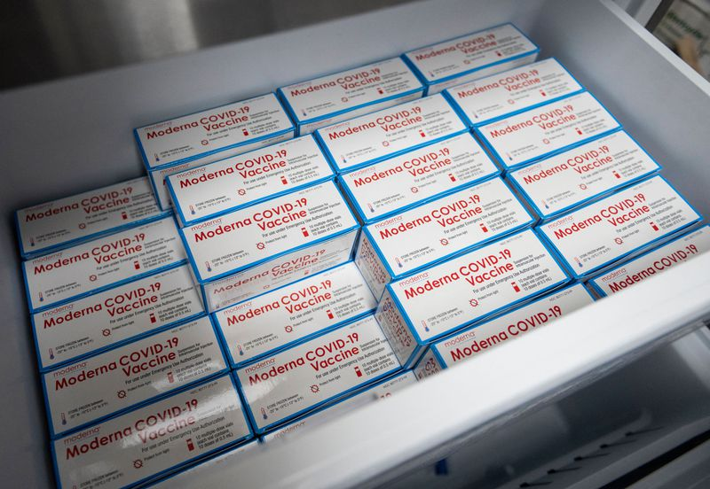

Moderna begins testing COVID vaccine on young children, babies  
================================================================

.. contents::
    :local:

    
https://www.nydailynews.com/coronavirus/ny-covid-moderna-testing-vaccine-on-children-20210316-t5gdhbc6yjgmrhjsvyflsynou4-story.html

Moderna begins testing COVID vaccine on young children, babies
By JESSICA SCHLADEBECK
NEW YORK DAILY NEWS |
MAR 16, 2021 AT 1:55 PM

Moderna has begun testing its COVID-19 vaccine on babies and young children, the drug company announced Tuesday.

First group of kids in two-phase clinical trial
-------------------------------------------------

6,800 children in the U.S. and Canada between 6 months and 11 years old
--------------------------------------------------------------------------

A first group of kids received their initial shot of the vaccine through a two-phase clinical trial, dubbed the KidCOVE study, in which researchers intend to recruit nearly 6,800 children in the U.S. and Canada between 6 months and 11 years old.

An analysis of how the young patients respond to different dose amounts in the first phase will help create the proper dosage used in the second phase, which will also include a placebo.

  
  Moderna Covid-19 vaccines

Moderna Covid-19 vaccines. (ANDREW CABALLERO-REYNOLDS/AFP via Getty Images)

The pediatric study “will help us assess the potential safety and immunogenicity of our COVID-19 vaccine candidate in this important younger age population” Moderna CEO Stéphane Bancel said in a statement.

Ad Choices
PAID POSTWhat Is This?
“Pain is my constant companion” while living with osteoarthritis
“Pain is my constant companion” while living with osteoarthritis
For Karen Marie, a lifetime of knee pain led to a diagnosis she saw coming. Four generations of family have OA.

SEE MORE Sponsored Content by Pfizer

The U.S. Food and Drug Administration in December approved the Moderna vaccine for adults and the Pfizer/BioNTech shot for people ages 16 and older. Johnson & Johnson’s shot for those 18 and up was approved in February.

More than 53 million doses of the Moderna vaccine have been administered in the U.S.

Last change: |today| 