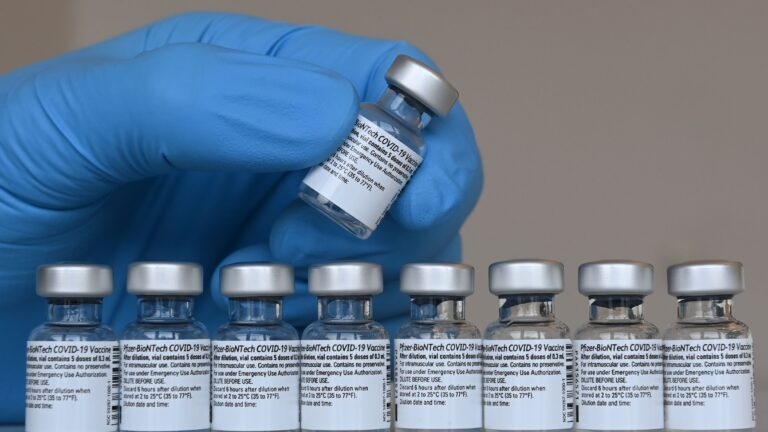

No mandated Use for Covid vaccines under the Emergency Use Authorization
===========================================================================

.. contents::
  :local:

  
  A health worker holds a vial of the Pfizer-BioNTech Covid-19 vaccine at a vaccination center in Pfaffenhofen, Germany.

CHRISTOF STACHE/AFP VIA GETTY IMAGES

https://www.statnews.com/2021/02/23/federal-law-prohibits-employers-and-others-from-requiring-vaccination-with-a-covid-19-vaccine-distributed-under-an-eua/

Federal law prohibits employers and others from requiring vaccination with a Covid-19 vaccine distributed under an Emergency Use Authorization EUA

By Aaron Siri Feb. 23, 2021

Ever since the Food and Drug Administration granted emergency use authorization for two new vaccines, employers, schools, and other organizations are grappling with whether to require Covid-19 vaccination.

While organizations are certainly free to encourage their employees, students, and other members to be vaccinated, federal law provides that, at least until the vaccine is licensed, individuals must have the option to accept or decline to be vaccinated.

Knowing what an organization can or cannot do with respect to Covid-19 vaccines can help them keep their employees, students, and members safe and also save the them from costly and time-consuming litigation.

Much remains unknown about the safety and efficacy of the vaccine

Even though the FDA granted emergency use authorizations for the Pfizer/BioNTech and Moderna vaccines in December 2020, the clinical trials the FDA will rely upon to ultimately decide whether to license these vaccines are still underway and are designed to last for approximately two years to collect adequate data to establish if these vaccines are safe and effective enough for the FDA to license.

The abbreviated timelines for the emergency use applications and authorizations means there is much the FDA does not know about these products even as it authorizes them for emergency use, including their effectiveness against asymptomatic infection, death, and transmission of SARS-CoV-2, the virus that causes the disease.

Given the uncertainty about the two vaccines, their EUAs are explicit that each is “an investigational vaccine not licensed for any indication” and require that all “promotional material relating to the Covid-19 Vaccine clearly and conspicuously … state that this product has not been approved or licensed by the FDA, but has been authorized for emergency use by FDA” (emphasis added).

Related: Covid-19 vaccine basics: Why the rollout is so slow, who can get doses, and what about side effects

EUAs are clear: Getting these vaccines is voluntary

The same section of the Federal Food, Drug, and Cosmetic Act that authorizes the FDA to grant emergency use authorization also requires the secretary of Health and Human Services to “ensure that individuals to whom the product is administered are informed … of the option to accept or refuse administration of the product.”

Likewise, the FDA’s guidance on emergency use authorization of medical products requires the FDA to “ensure that recipients are informed to the extent practicable given the applicable circumstances … That they have the option to accept or refuse the EUA product …”

In the same vein, when Dr. Amanda Cohn, the executive secretary of the CDC’s Advisory Committee on Immunization Practices, was asked if Covid-19 vaccination can be required, she responded that under an EUA, “vaccines are not allowed to be mandatory. So, early in this vaccination phase, individuals will have to be consented and they won’t be able to be mandatory.” Cohn later affirmed that this prohibition on requiring the vaccines applies to organizations, including hospitals.

The EUAs for both the Pfizer/BioNTech and Moderna vaccines require facts sheets to be given to vaccination providers and recipients. These fact sheets make clear that getting the vaccine is optional. For example, the one for recipients states that, “It is your choice to receive or not receive the Covid-19 Vaccine,” and if “you decide to not receive it, it will not change your standard of medical care.”

What this means in practice

When the FDA grants emergency use authorization for a vaccine, many questions about the product cannot be answered. Given the open questions, when Congress granted the authority to issue EUAs, it chose to require that every individual should be allowed to decide for himself or herself whether or not to receive an EUA product. The FDA and CDC apparently consider this fundamental requirement of choice important enough that even during the height of the Covid-19 pandemic they reinforced that policy decision when issuing their guidance related to the Covid-19 vaccines.

This means that an organization will likely be at odds with federal law if it requires its employees, students or other members to get a Covid-19 vaccine that is being distributed under emergency use authorization.

State law often prohibits retaliating against an employee for refusing to participate in a violation of federal law. Organizations that require Covid-19 vaccination in violation of federal law may face lawsuits under these state laws not only to block the policy but also for damages and attorneys’ fees. Such potentially costly lawsuits can be avoided by refraining from adopting policies that require vaccination or penalize members for choosing not to be vaccinated.

Organizations are free to encourage vaccinations through internal communications, through educational events, and through other measures to urge employees to be vaccinated. They can take these measures so long as: (1) they are not viewed as coercive, (2) the organization makes clear the decision regarding whether to receive the vaccine is voluntary, and (3) the measures comply with the requirements in the EUAs and the related regulations for these products.

People across the world have had their lives upended during the last year. The urgency to return to normalcy is felt deeply by many. As decision-makers at organizations decide on their Covid-19 vaccination policy, they should be careful to not let this passion lead the organization to run afoul of the law.

About the Author 
Aaron Siri is the managing partner at Siri & Glimstad LLP, a complex civil litigation firm with its principal office in New York City. This article is not intended to provide legal advice but to offer broad and general information about the law.

Aaron Siri
 aaron@sirillp.com

https://www.statnews.com/2021/02/23/federal-law-prohibits-employers-and-others-from-requiring-vaccination-with-a-covid-19-vaccine-distributed-under-an-eua/

Last change: |today|