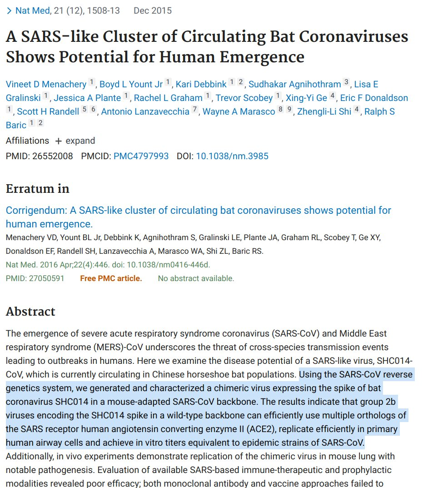

Normal GOF Research
---------------------

Source `Twitter exchange image1`_.

.. _Twitter exchange image1: https://twitter.com/ThomasConnors/status/1245566505011552257

From 2015 PubMed 

National Center for Biotechnology Information Bethesda MD 

the same cast of characters publishing from the Wuhan level 4 lab: 

A SARS-like Cluster of Circulating Bat Coronaviruses Shows Potential for Human Emergence
2015 USA PubMed Bethesda MD: 

"Using SARS-CoV reverse genetics system we generated & characterized a chimeric virus expressing  spike of bat coronavirus in a mouse-adapted SARS-CoV backbone 
ACE2 replicate efficiently human airway cells achieve epidemic"

Source `Twitter exchange`_.

.. _Twitter exchange: https://twitter.com/ThomasConnors/status/1245566505011552257

15 Authors, labs including Wuhan & Dana Farber in Boston & Harvard in Cambridge. wtf, lots of people working on this the budget must have been in the millions, this is normal stuff. This is just one paper there are many many. They've demonstrated most of the features of #COVID19

Why was top virus researcher being coy/disingenuous/lying?!? He told Joe Rogan "it is natural we are not smart enough to invent" yet by using caged ferrets & repeatedly exposing to viruses they routinely see what nature creates and harvest the best strains

New from @jjcouey JC on a Bike (Univ Pitt researcher). It is routine to evolve virus using caged ferrets repeatedly exposed to viruses & harvest the best strains. Why is Wuhan Harvard, NC Chapel Hill jointly doing research in 2015?

Last change: |today|