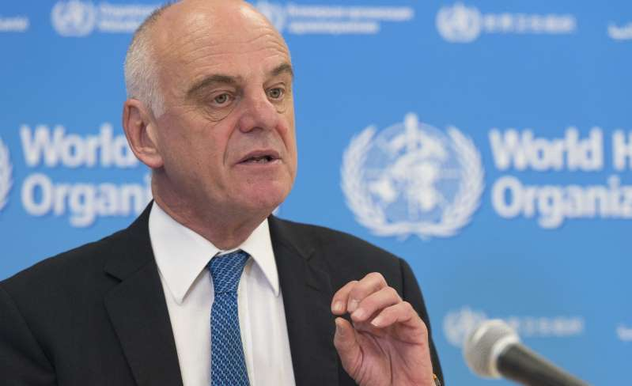

The Dodgy Dealings of Pfizer Exposed
=========================================

https://dailyexpose.co.uk/2021/03/02/the-dodgy-dealings-of-pfizer-exposed/

BY THE DAILY EXPOSE ON MARCH 2, 2021 • ( 2 COMMENTS )

Before Pfizer’s experimental mRNA technology was globally approved as a “safe” vaccine against the alleged Covid-19 disease, the pharmaceutical giant was already negotiating with governments around the world on how to deal with any adverse reactions to their experimental jab.

Pfizer has lobbied entire legislative bodies to indemnify vaccine makers from future vaccine injury lawsuits. In a contract with the government of Brazil, Pfizer made ransom demands, requiring Brazil to waive the sovereignty of its assets abroad to cover for Pfizer’s negligence.

Pfizer demanded that Brazil create a guarantee fund and deposit that money in a foreign bank account to cover all future vaccine injury liabilities. Brazil’s Health Ministry refused Pfizer’s demands and made them public on the 23rd January 2021. In the contract, Pfizer demanded that the laws of Brazil would NOT apply to Pfizer, to exempt the company from all civil liability.

Some countries have readily complied with Pfizer, granting the vaccine maker legal immunity from civil and criminal lawsuits when their experimental vaccine protocol harms human health and takes people’s lives. Other countries have taken a more judicial approach, rejecting Pfizer’s call for absolute indemnity.

Pfizer’s ransom demands in Argentina
---------------------------------------------------------------

Pfizer’s ransom demands were even more berserk in Argentina. Pfizer demanded that the Government of Argentina foot the bill and compensate all future civil lawsuits when the vaccine injures people. Pfizer lobbied the Argentina Parliament to pass a law in October of 2020 to ensure their protection. When the parliament wrote that Pfizer needed to pay for future negligence, Pfizer rejected the deal.

The parliament ultimately acquiesced to Pfizer and defined negligence to include only vaccine distribution and delivery. Pfizer rejected this offer, too, and demanded a new decree — one that would hold the government of Argentina hostage. Pfizer demanded that Argentina purchase an international insurance policy to cover for all future civil cases against Pfizer. When Argentina agreed, Pfizer made even more demands, requiring Argentina to put their sovereign assets up as collateral. Pfizer wanted Argentina to put their bank reserves, military bases, and embassy buildings as collateral in the deal.

Pfizer understands what’s at stake. They have been fined over £3.5 billion in medical and safety offences, and participated in the largest healthcare fraud of the century – illegally promoting certain pharmaceutical products. Their latest mRNA technology, promoted as a “safe and efficacious” vaccine, is more of the same fraud and Pfizer’s top scientists know it. The co-founder of the new Pfizer’s vaccine, Dr Ugur Sahin, confirmed that the inoculation was created in a few hours on January 25, 2020. The technology is easily mass produced and was ready to be unleashed on the world in the summer of 2020.

.. Note::
    In the early 1980s, vaccine injury was prevalent and openly discussed, with children suffering injuries from vaccines that contained tetanus and pertussis toxoids and a highly reactive adjuvant.

For thirty-four years, vaccine companies have operated ABOVE THE LAW in the United States. In the early 1980s, vaccine injury was prevalent and openly discussed, with children suffering injuries from vaccines that contained tetanus and pertussis toxoids and a highly reactive adjuvant.

.. Note::
    In order to maintain vaccine supply and prevent the bankruptcy and criminal prosecution of vaccine companies, Congress passed the 1986 National Childhood Vaccine Injury Act.

By 1986, a majority in Congress were still convinced that the benefits of vaccination outweighed the risks of a potential infection, even with viable treatments at hand. In order to maintain vaccine supply and prevent the bankruptcy and criminal prosecution of vaccine companies, Congress passed the 1986 National Childhood Vaccine Injury Act.

.. Note::
    the Department of Health and Human Services was required to study the safety of vaccines and improve vaccine science, with a report to Congress every two years; however, these studies did not take place over the past thirty-four years

This new law, signed by former President Ronald Reagan, granted vaccine companies immunity from prosecution when their products injured or killed people. As part of the trade-off, the Department of Health and Human Services was required to study the safety of vaccines and improve vaccine science, with a report to Congress every two years; however, these studies did not take place over the past thirty-four years, as confirmed by a revolutionary lawsuit filed by the Informed Consent Action (ICAN).

Congress and the regulatory agencies
--------------------------------------

Caption WHO Dr David Nabarro "don't do lockdowns"    
    
Legend this is the legend

By turning a blind eye toward vaccine injury, Congress and the regulatory agencies gave vaccine companies an open door to push new vaccines into the arms of children and adults. If an individual is injured or dies from a vaccine, the vaccine maker is not liable; instead, the US federal government defends the vaccine in a special vaccine court that pays out damages only to select victims. Many cases are litigated for years before a settlement is reached, while countless other injuries are ignored. In the first three months of 2020, $57 million was paid out to families suffering from vaccine injury.

.. Note:: 
    Vaccine makers’ legal immunity helped create the CDC’s ever-expanding vaccine schedule which quickly made future generations vaccine-dependent, inundating children with upwards of 56 vaccine doses by the turn of the century. Today, vaccine companies lobby state government officials to take away any personal exemptions to vaccination, bullying parents to comply with a long list of vaccines in order to enroll their children in a public school.

Vaccine makers’ legal immunity helped create the CDC’s ever-expanding vaccine schedule which quickly made future generations vaccine-dependent, inundating children with upwards of 56 vaccine doses by the turn of the century. Today, vaccine companies lobby state government officials to take away any personal exemptions to vaccination, bullying parents to comply with a long list of vaccines in order to enroll their children in a public school.

.. Note:: 
    The UK has also only approved the Pfizer jab for emergency use, which means Pfizer are not liable for any injury that occurs due to their vaccine – the British taxpayer is instead.

The UK has also only approved the Pfizer jab for emergency use, which means Pfizer are not liable for any injury that occurs due to their vaccine – the British taxpayer is instead.

.. Note::
    Now vaccine makers are working with the airline industry, concert venues, Tony Blair and entire governments to enforce a Vaccine Passport for everyone. The coercion, force, fraud and criminal demands of vaccine companies is one of the greatest threats to health, liberty and human rights in the 21st century.

Now vaccine makers are working with the airline industry, concert venues, Tony Blair and entire governments to enforce a Vaccine Passport for everyone. The coercion, force, fraud and criminal demands of vaccine companies is one of the greatest threats to health, liberty and human rights in the 21st century.

Last change: |today|