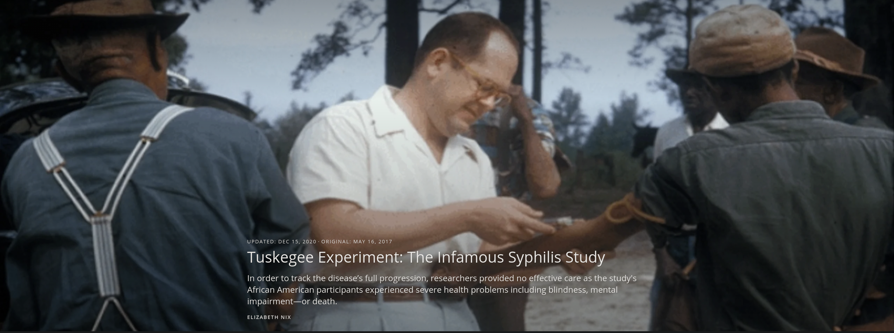
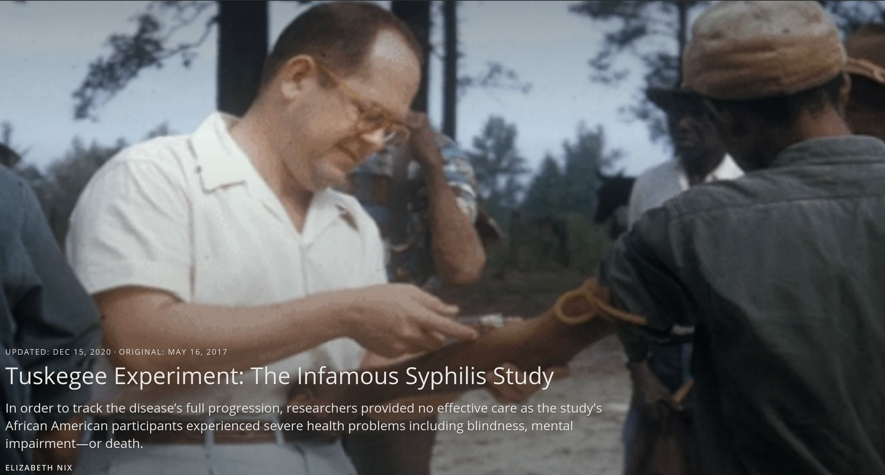
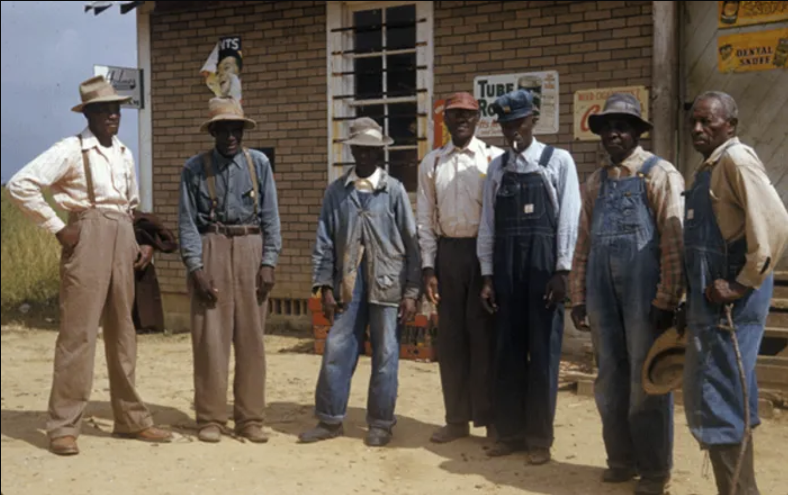
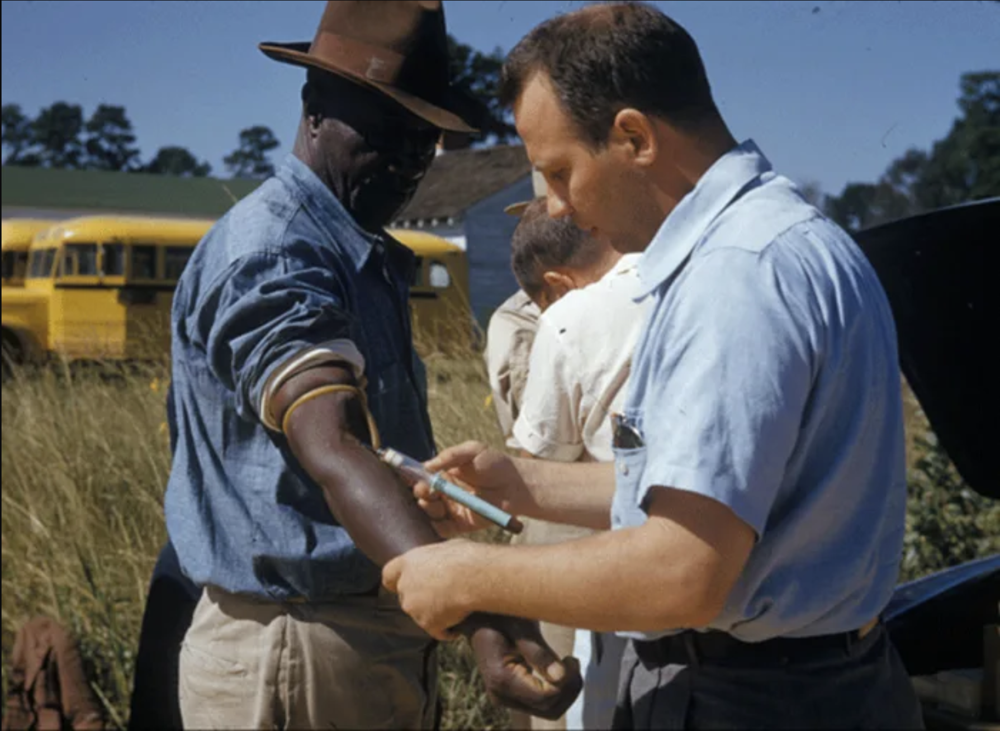
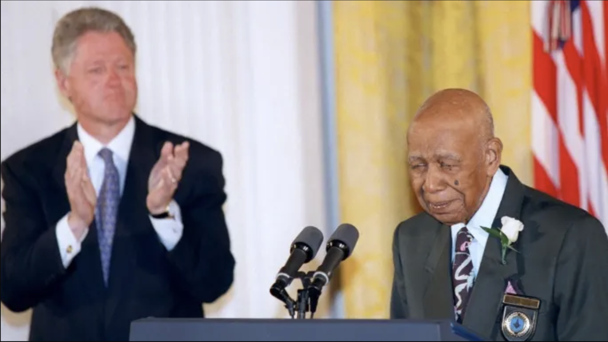

Tuskgee Medical Experiments - 40 years of untreated Syphlis    
==============================================================

.. contents::
  :local:

  
  White doctor injecting black farm worker

The National Archives

  
  Tuskgee Medical Experiments - 40 years of untreated Syphlis

The National Archives

.. figure:: assets/Vaccines/History-Lessons/Tuskegee-Experiment-1932-1972/1-zoom-Tuskegee-Experiment-1932-1972.png
  :align: center
  :width: 80 %
  
  Participants in the Tuskegee Syphilis Study

UPDATED: DEC 15, 2020 ORIGINAL: MAY 16, 2017
HISTORY.COM Tuskegee Experiment: The Infamous Syphilis Study HERE_

.. _HERE: https://www.history.com/news/the-infamous-40-year-tuskegee-study

In order to track the disease’s full progression, researchers provided no effective care as the study's African American participants experienced severe health problems including blindness, mental impairment—or death.

By ELIZABETH NIX

The Tuskegee experiment began in 1932, at at a time when there was no known treatment for syphilis, a contagious venereal disease. After being recruited by the promise of free medical care, 600 African American men in Macon County, Alabama were enrolled in the project, which aimed to study the full progression of the disease.

The participants were primarily sharecroppers, and many had never before visited a doctor. Doctors from the U.S. Public Health Service (PHS), which was running the study, informed the participants—399 men with latent syphilis and a control group of 201 others who were free of the disease—they were being treated for bad blood, a term commonly used in the area at the time to refer to a variety of ailments.

READ MORE: The ‘Father of Modern Gynecology’ Performed Shocking Experiments on Enslaved Women

  
  A man receiving treatment in the Tuskegee Syphilis Study 

The men were monitored by health workers but only given placebos such as aspirin and mineral supplements, despite the fact that penicillin became the recommended treatment for syphilis in 1947, some 15 years into the study. PHS researchers convinced local physicians in Macon County not to treat the participants, and instead research was done at the Tuskegee Institute. (Now called Tuskegee University, the school was founded in 1881 with Booker T. Washington at its first teacher.)

In order to track the disease’s full progression, researchers provided no effective care as the men died, went blind or insane or experienced other severe health problems due to their untreated syphilis.

In the mid-1960s, a PHS venereal disease investigator in San Francisco named Peter Buxton found out about the Tuskegee study and expressed his concerns to his superiors that it was unethical. In response, PHS officials formed a committee to review the study but ultimately opted to continue it—with the goal of tracking the participants until all had died, autopsies were performed and the project data could be analyzed.

Buxton then leaked the story to a reporter friend, who passed it on to a fellow reporter, Jean Heller of the Associated Press. Heller broke the story in July 1972, prompting public outrage and forcing the study to finally shut down.

By that time, 28 participants had perished from syphilis, 100 more had passed away from related complications, at least 40 spouses had been diagnosed with it and the disease had been passed to 19 children at birth.

READ MORE: Henrietta Lacks: How Her Cells Became One of the Most Important Medical Tools in History

  
  A man receiving treatment in the Tuskegee Syphilis Study 

In 1973, Congress held hearings on the Tuskegee experiments, and the following year the study’s surviving participants, along with the heirs of those who died, received a $10 million out-of-court settlement. Additionally, new guidelines were issued to protect human subjects in U.S. government-funded research projects.

As a result of the Tuskegee experiment, many African Americans developed a lingering, deep mistrust of public health officials and vaccines. In part to foster racial healing, President Bill Clinton issued a 1997 apology, stating, “The United States government did something that was wrong—deeply, profoundly, morally wrong… It is not only in remembering that shameful past that we can make amends and repair our nation, but it is in remembering that past that we can build a better present and a better future.”

During his apology, Clinton announced plans for the establishment of Tuskegee University’s National Center for Bioethics in Research and Health Care.

The final study participant passed away in 2004.

READ MORE: 7 of the More Outrageous Medical Treatments in History

  
  Herman Shaw speaks as President Bill Clinton looks on, during ceremonies at the White House on May 16, 1997. Clinton apologized to the survivors and families of the victims of the Tuskegee Syphilis Study.

*Paul J. Richards/AFP/Getty Images*

*Herman Shaw speaks as President Bill Clinton looks on during ceremonies at the White House on May 16, 1997, during which Clinton apologized to the survivors and families of the victims of the Tuskegee Syphilis Study.*

Tuskegee wasn't the first unethical syphilis study. In 2010, then-President Barack Obama and other federal officials apologized for another U.S.-sponsored experiment, conducted decades earlier in Guatemala. In that study, from 1946 to 1948, nearly 700 men and women—prisoners, soldiers, mental patients—were intentionally infected with syphilis (hundreds more people were exposed to other sexually transmitted diseases as part of the study) without their knowledge or consent.

The purpose of the study was to determine whether penicillin could prevent, not just cure, syphilis infection. Some of those who became infected never received medical treatment. The results of the study, which took place with the cooperation of Guatemalan government officials, were never published. The American public health researcher in charge of the project, Dr. John Cutler, went on to become a lead researcher in the Tuskegee experiments.

Following Cutler’s death in 2003, historian Susan Reverby uncovered the records of the Guatemala experiments while doing research related to the Tuskegee study. She shared her findings with U.S. government officials in 2010. Soon afterward, Secretary of State Hillary Clinton and Secretary of Health and Human Services Kathleen Sebelius issued an apology for the STD study and President Obama called the Guatemalan president to apologize for the experiments.

Last change: |today|