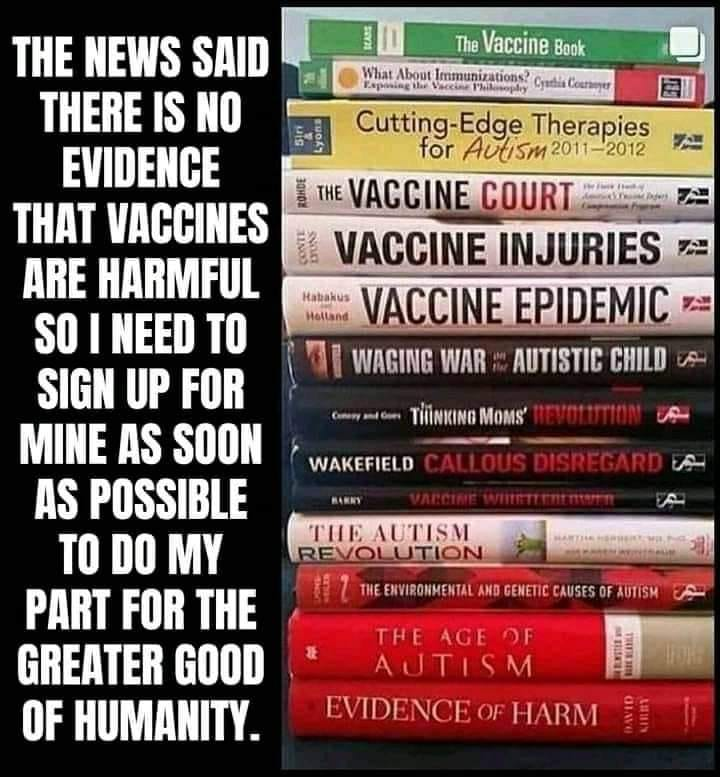

Vaccines - Future Topics  
====================================

.. toctree::
   :maxdepth: 2
   :caption: Contents:

   
.. contents::
    :local:

   
Vaccine Books
---------------------------------------------------

Vaccine Books

  
  Vaccine Books 

What is the history of vaccines, how much money and what are they used for    
------------------------------------------------------------------------------

What funding and research has been done with vaccines and fertility management  
--------------------------------------------------------------------------------

What funding and research has been done with vaccines and nano particles    
------------------------------------------------------------------------------

What are nano particles    
------------------------------------------------------------------------------

Who was Harvard Chemistry Department Chair and nano particle expert Charles Lieber and why was he arrested  
-------------------------------------------------------------------------------------------------------------

Last change: |today|