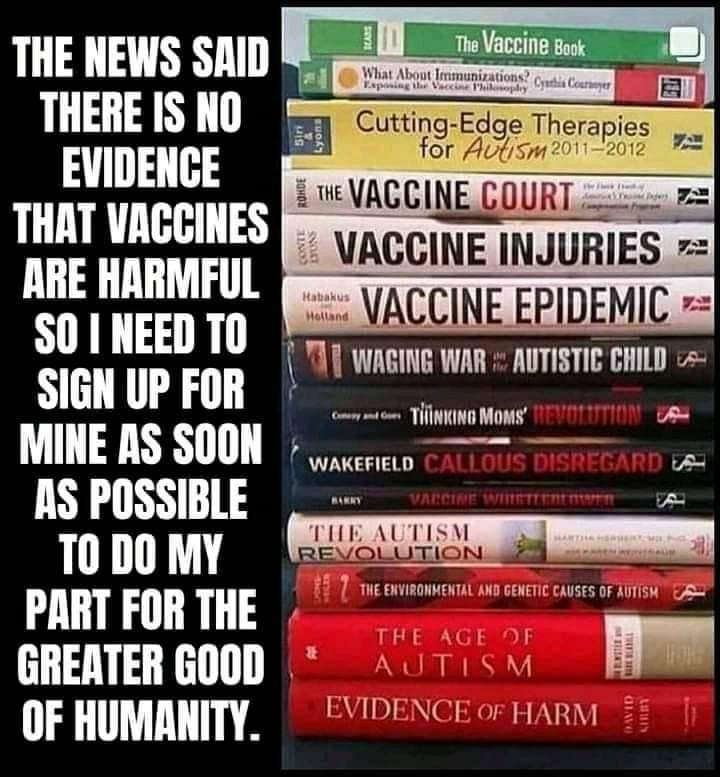

Vaccines
==========

.. toctree::
   :maxdepth: 2
   :caption: Contents:

   Moderna-testing-in-young-children-and-babies
   Dr-Sherri-Tenpenny-explains-7-mechanisms-in-mRNA-vaccines
   Children's-Vaccine-Recommended-or-Required-or-Widely-Available-Schedule-1960's-to-2018
   
.. contents::
    :local:

Over 12,000 people test positive for COVID-19 after receiving Pfizer vaccine
-----------------------------------------------------------------------------

Over 12,000 people test positive for COVID-19 after receiving Pfizer vaccine

.. figure:: assets/israel-positive-after-gene-therapy.jpg
  :width: 80 %
  :alt: Over 12,000 people test positive for COVID-19 after receiving Pfizer vaccine 

   
Vaccine Books
---------------------------------------------------

Vaccine Books

What is the history of vaccines, how much money and what are they used for    
------------------------------------------------------------------------------

What funding and research has been done with vaccines and fertility management  
--------------------------------------------------------------------------------

What funding and research has been done with vaccines and nano particles    
------------------------------------------------------------------------------

What are nano particles    
------------------------------------------------------------------------------

Who was Harvard Chemistry Department Chair and nano particle expert Charles Lieber and why was he arrested  
-------------------------------------------------------------------------------------------------------------

Last change: |today|