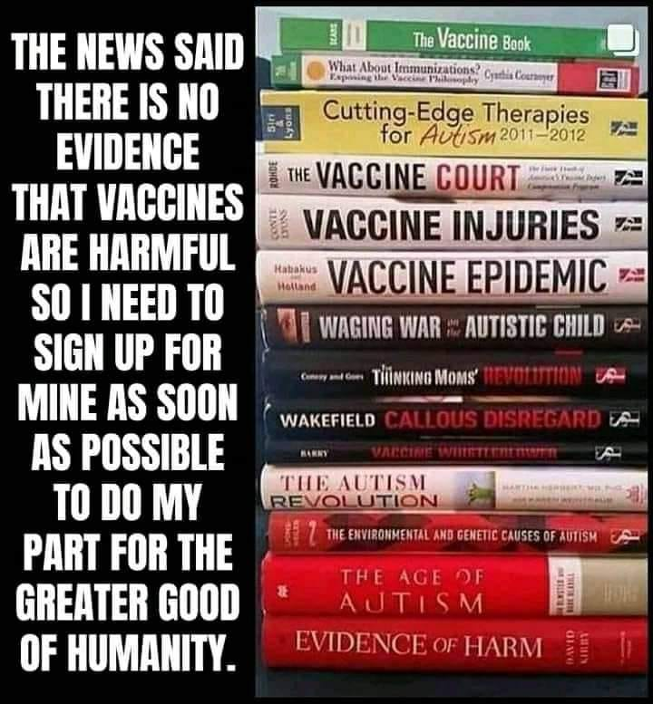

Vaccines
==========

.. toctree::
   :maxdepth: 2
   :caption: Contents:

   Dr Sherri Tenpenny explains 7 mechanisms in mRNA vaccines
   COVID-19 Vaccines In the News
   Children's Vaccine Recommended or Required or Widely Available Schedule 1960's to 2018
   24 get virus between first and second vaccine Gatineau nursing home
   What is the history of vaccines, how much money and what are they used for
   A History of Pfizer
   A history of Johnson & Johnson

Vaccine Books
---------------------------------------------------

Vaccine Books

What is the history of vaccines, how much money and what are they used for    
------------------------------------------------------------------------------

What funding and research has been done with vaccines and fertility management  
--------------------------------------------------------------------------------

What funding and research has been done with vaccines and nano particles    
------------------------------------------------------------------------------

What are nano particles    
------------------------------------------------------------------------------

Who was Harvard Chemistry Department Chair and nano particle expert Charles Lieber and why was he arrested  
-------------------------------------------------------------------------------------------------------------

Last change: |today|