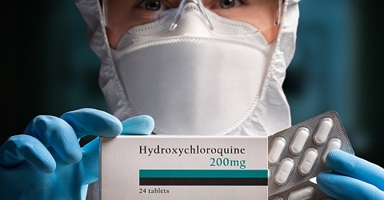

WHO: The different types of COVID-19 vaccines
================================================

.. toctree::
    :maxdepth: 2
    :caption: Contents:
 

.. contents::
    :local:

    

  
  Hydroxychloroquine

The different types of COVID-19 vaccines
12 January 2021

.. Note:: 
    
    This page was Retrieved and copied March 25 2021
    https://www.who.int/news-room/feature-stories/detail/the-race-for-a-covid-19-vaccine-explained

This article is part of a series of explainers on vaccine development and distribution. Learn more about vaccines – from how they work and how they’re made to ensuring safety and equitable access – in WHO’s Vaccines Explained series.

As of December 2020, there are over 200 vaccine candidates for COVID-19 being developed. Of these, at least 52 candidate vaccines are in human trials. There are several others currently in phase I/II, which will enter phase III in the coming months (for more information on the clinical trial phases, see part three of our Vaccine Explained series).

Why are there so many vaccines in development?
Typically, many vaccine candidates will be evaluated before any are found to be both safe and effective. For example, of all the vaccines that are studied in the lab and laboratory animals, roughly 7 out of every 100 will be considered good enough to move into clinical trials in humans. Of the vaccines that do make it to clinical trials, just one in five is successful. Having lots of different vaccines in development increases the chances that there will be one or more successful vaccines that will be shown to be safe and efficacious for the intended prioritized populations.

Vaccines Topics Four images working 01

The different types of vaccines
There are three main approaches to designing a vaccine. Their differences lie in whether they use a whole virus or bacterium; just the parts of the germ that triggers the immune system; or just the genetic material that provides the instructions for making specific proteins and not the whole virus.

Vaccines Topics Four images working 02

The whole-microbe approach
Inactivated vaccine

The first way to make a vaccine is to take the disease-carrying virus or bacterium, or one very similar to it, and inactivate or kill it using chemicals, heat or radiation. This approach uses technology that’s been proven to work in people – this is the way the flu and polio vaccines are made – and vaccines can be manufactured on a reasonable scale. 

However, it requires special laboratory facilities to grow the virus or bacterium safely, can have a relatively long production time, and will likely require two or three doses to be administered.

Live-attenuated vaccine

A live-attenuated vaccine uses a living but weakened version of the virus or one that’s very similar. The measles, mumps and rubella (MMR) vaccine and the chickenpox and shingles vaccine are examples of this type of vaccine. This approach uses similar technology to the inactivated vaccine and can be manufactured at scale. However, vaccines like this may not be suitable for people with compromised immune systems.

Viral vector vaccine

This type of vaccine uses a safe virus to deliver specific sub-parts – called proteins – of the germ of interest so that it can trigger an immune response without causing disease. To do this, the instructions for making particular parts of the pathogen of interest are inserted into a safe virus. The safe virus then serves as a platform or vector to deliver the protein into the body.  The protein triggers the immune response. The Ebola vaccine is a viral vector vaccine and this type can be developed rapidly.

The subunit approach
Vaccines Topics Four images working 03

A subunit vaccine is one that only uses the very specific parts (the subunits) of a virus or bacterium that the immune system needs to recognize. It doesn't contain the whole microbe or use a safe virus as a vector. The subunits may be proteins or sugars. Most of the vaccines on the childhood schedule are subunit vaccines, protecting people from diseases such as whooping cough, tetanus, diphtheria and meningococcal meningitis.

Vaccines Topics Four images working 04
The genetic approach (nucleic acid vaccine)
Unlike vaccine approaches that use either a weakened or dead whole microbe or parts of one, a nucleic acid vaccine just uses a section of genetic material that provides the instructions for specific proteins, not the whole microbe. DNA and RNA are the instructions our cells use to make proteins. In our cells, DNA is first turned into messenger RNA, which is then used as the blueprint to make specific proteins. 

Vaccines Topics Four images working 05 DNA RNA v2

A nucleic acid vaccine delivers a specific set of instructions to our cells, either as DNA or mRNA, for them to make the specific protein that we want our immune system to recognize and respond to. 

The nucleic acid approach is a new way of developing vaccines. Before the COVID-19 pandemic, none had yet been through the full approvals process for use in humans, though some DNA vaccines, including for particular cancers, were undergoing human trials. Because of the pandemic, research in this area has progressed very fast and some mRNA vaccines for COVID-19 are getting emergency use authorization, which means they can now be given to people beyond using them only in clinical trials.

Last change: |today| 