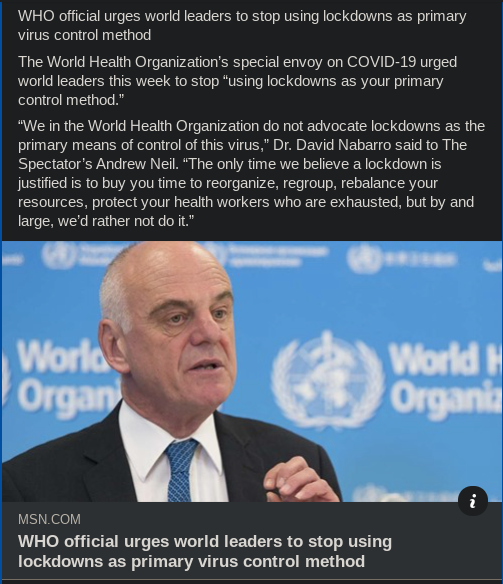
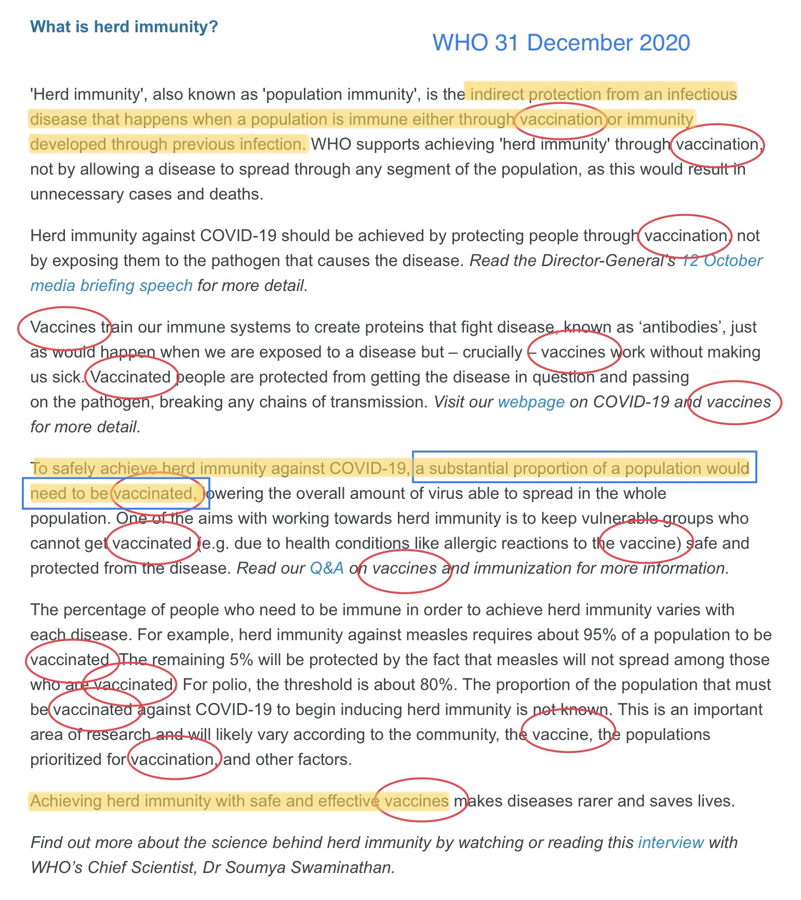
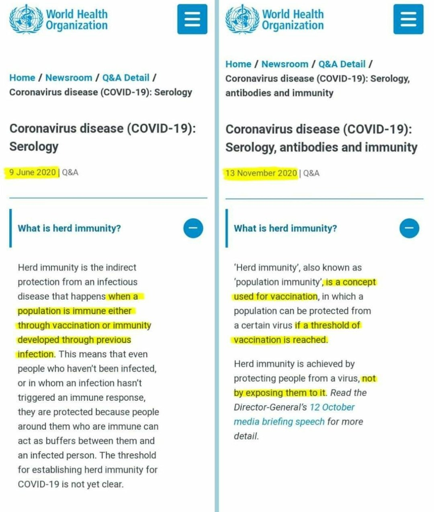
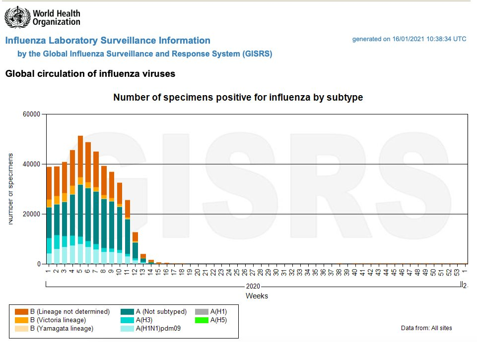
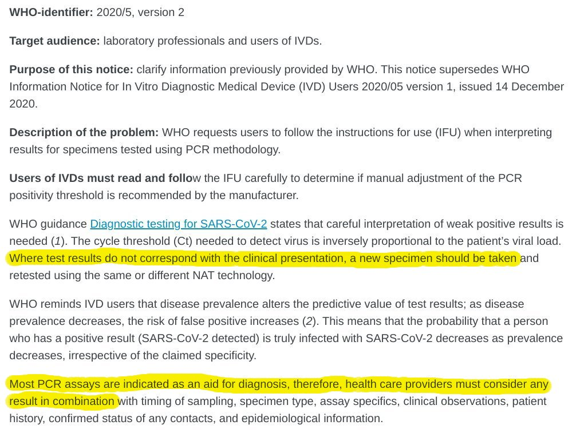

WHO World Health Organization
===============================

.. contents::
    :local:
  

.. figure:: assets/Vaccines/WHO/WHO-Dr-David-Nabarro-dont-do-lockdowns.jpeg
  :width: 80 %
    
  WHO Dr David Nabarro dont do lockdowns 

  Caption WHO Dr David Nabarro "don't do lockdowns"    
    
Legend this is the legend

    
  WHO do not do lockdowns 

Caption WHO do not do lockdowns    

Legend this is the legend

Vaccine Definition Merriam-Webster Feb-5-2021 vs Mar-31-2019
--------------------------------------------------------------

Vaccine Definition Merriam-Webster Feb-5-2021 vs Mar-31-2019

Source:
Something interesting to notice-
If something doesn’t fall under a certain description outlined for indemnity, what do you do? Why, you change the definition to cover your ass! That’s what you do!
https://twitter.com/LynnFynn3/status/1368228908810842117
10:56 AM · Mar 6, 2021·
@LynnFynn3

.. figure:: assets/Vaccines/vaccine-definition-Merriam-Webster-Feb-5-2021-vs-Mar-31-2019.jpeg
  :width: 80 %
    
  Vaccine Definition Merriam-Webster Feb-5-2021 vs Mar-31-2019 

WHO herd immunity definition Dec-31-2020
---------------------------------------------------

WHO herd immunity definition Dec-31-2020

Source:
Replying to 
@Heachy_1979
GOOD NEWS: A month and a half later the WHO edited the text to put natural immunity back in, but...
BAD NEWS: They made natural immunity sound evil and plastered VACCINE into definition. In fact it is now mentioned SEVENTEEN times. Speaks to an agenda. 
https://twitter.com/birb_k/status/1368440134618681346
12:55 AM · Mar 7, 2021
@birb_k

    
  WHO herd immunity definition Dec-31-2020 

WHO Herd Immunity Definition June VS Nov 2020
---------------------------------------------------

WHO Herd Immunity Definition June VS Nov 2020

Source:
https://twitter.com/LynnFynn3/status/1368238151609769994
11:32 AM · Mar 6, 2021
@LynnFynn3

    
  WHO Herd Immunity Definition June VS Nov 2020 

WHO 2020 Global flu counts
---------------------------------------------------

WHO 2020 Global flu counts

    
  WHO 2020 Global flu counts 

WHO official urges world leaders to stop using lockdowns as primary virus control method    
-----------------------------------------------------------------------------------------

- The World Health Organization’s special envoy on COVID-19 urged world leaders this week to stop “using lockdowns as your primary control method.”  
- “We in the World Health Organization do not advocate lockdowns as the primary means of control of this virus,” Dr. David Nabarro said to The Spectator’s Andrew Neil.   
- “The only time we believe a lockdown is justified is to buy you time to reorganize, regroup, rebalance your resources, protect your health workers who are exhausted, but by and large, we’d rather not do it.”  

  
.. figure:: assets/Vaccines/WHO/WHO-Dr-David-Nabarro-dont-do-lockdowns.jpeg
  :width: 80 %
  
  WHO-Dr-David-Nabarro-dont-do-lockdowns

Source: [MSN "WHO: stop using lockdowns as primary virus control method" October 10 2020](https://www.msn.com/en-us/health/medical/who-official-urges-world-leaders-to-stop-using-lockdowns-as-primary-virus-control-method/ar-BB19TBUo?fbclid=IwAR2ErYb8DhCy3tGuMj8DdolYhmbftMKCfCLEYPW1qT4PCt7uSK9nqnkgx0w)

The WHO is recommending key changes to PCR testing
----------------------------------------------------

The WHO is recommending some changes to PCR testing.    

"PCR positive" is no longer a Covid "case"      

You are not Covid "case" now unless you get a second test to confirm it, and are presenting clinical symptoms.  
WHO guidance Diagnostic testing for SARS-CoV-2 states that careful interpretation of weak positive results is needed (1). The cycle threshold (Ct) needed to detect virus is inversely proportional to the patient’s viral load. Where test results do not correspond with the clinical presentation, a new specimen should be taken and retested using the same or different NAT technology.  

WHO reminds IVD users that **disease prevalence alters the predictive value of test results**; *as disease prevalence decreases, the risk of false positive increases (2). This means that the probability that a person who has a positive result (SARS-CoV-2 detected) is truly infected with SARS-CoV-2 decreases as prevalence decreases, irrespective of the claimed specificity.*    

  
  WHO Jan 20 2021 PCR changes

Source: [WHO requests users to follow the instructions for use (IFU) when interpreting results for specimens tested using PCR methodology. January 20 2021](https://www.who.int/news/item/20-01-2021-who-information-notice-for-ivd-users-2020-05)

Last change: |today|