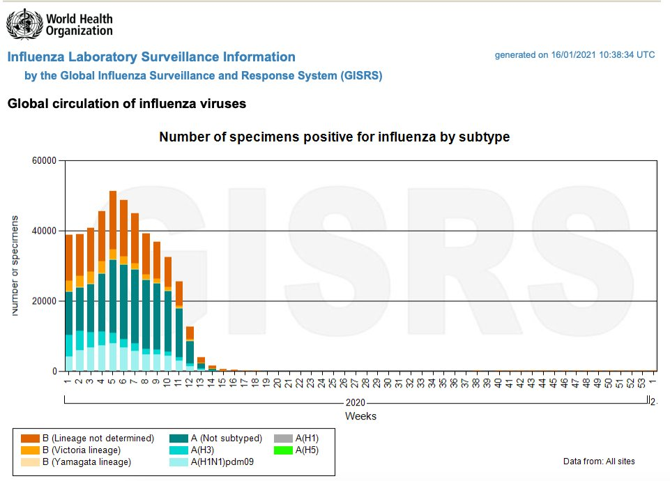
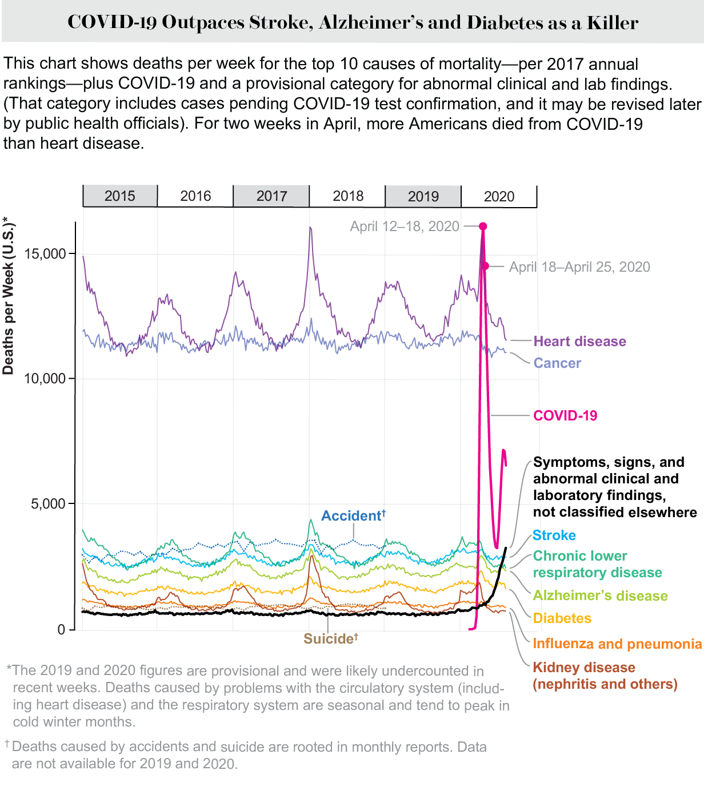

test2
=====

This is test2

.. figure:: assets/Flu_Covid_1916_to_December_2020.jpg
  :scale: 30 %
  :alt: Flu vs. Covid 1916 to December 2020 

.. figure:: assets/Flu_Covid_1916_to_December_2020.jpg
  :scale: 50 %
  :alt: Flu vs. Covid 1916 to December 2020 

.. figure:: assets/Flu_Covid_1916_to_December_2020.jpg
  :scale: 80 %
  :alt: Flu vs. Covid 1916 to December 2020 

.. figure:: assets/Flu_Covid_1916_to_December_2020.jpg
  :scale: 100 %
  :alt: Flu vs. Covid 1916 to December 2020 

WHO 2020 Global flu counts

.. figure:: assets/UK-daily-deaths-2015-2020-large.jpeg.jpg
  :scale: 100 %
  :alt: UK daily deaths 2015-2020 

.. figure:: assets/CDC-survival-rates-by-age-September-2020.jpeg
  :scale: 100 %
  :alt: CDC survival rates by age September 2020 

<h1> Letter to the town of Brookine Massachusetts    </h1> 

<h2> FY2021 revised budget revised budget highlights </h2> 

   

</b>

Source: [FY 2021 Revised Budget Presentation to the Select Board](https://www.brooklinema.gov/DocumentCenter/View/21900/Revised-FY2021-Budet-Presentation-to-the-Select-Board-June-2-2020?bidId=)

<h2> FY2021 revised budget assumptions local receipts </h2> 

   

</b>

<h2> FY2021 Revised Budget: Departmental Reductions </h2> 

   

</b>

<h2> Brookline Health: Budget 2018-2021 </h2> 

   

</b>

Source: [Financial Plan - Live Tracking](https://brooklinema.opengov.com/transparency/42952/accountType=expenses&embed=n&breakdown=types&currentYearAmount=cumulative&currentYearPeriod=years&graph=bar&legendSort=coa&month=2&proration=false&saved_view=141455&selection=48FF762B5E4BCEF083F472B45A84F80F&projections=null&projectionType=null&highlighting=null&highlightingVariance=null&year=2020&selectedDataSetIndex=null&fiscal_start=earliest&fiscal_end=latest)

<h2> Brookline Health: Salaries 2018-2021 </h2> 
   

</b>

<h2> WHO official urges world leaders to stop using lockdowns as primary virus control method   </h2> 
<ul>
  <li>The World Health Organization’s special envoy on COVID-19 urged world leaders this week to stop “using lockdowns as your primary control method.”</li>  
  <li>“We in the World Health Organization do not advocate lockdowns as the primary means of control of this virus,” Dr. David Nabarro said to The Spectator’s Andrew Neil. </li>  
  <li>“The only time we believe a lockdown is justified is to buy you time to reorganize, regroup, rebalance your resources, protect your health workers who are exhausted, but by and large, we’d rather not do it.”</li>  
</ul>

  
  

   

</b>

Source: [MSN "WHO: stop using lockdowns as primary virus control method" October 10 2020](https://www.msn.com/en-us/health/medical/who-official-urges-world-leaders-to-stop-using-lockdowns-as-primary-virus-control-method/ar-BB19TBUo?fbclid=IwAR2ErYb8DhCy3tGuMj8DdolYhmbftMKCfCLEYPW1qT4PCt7uSK9nqnkgx0w)

<h2> UK virus cases hospital ICU deaths</h2>

   

</b>

Source: [Twitter Christina Pagel @chrischirp Jan 16, 2021](https://twitter.com/chrischirp/status/1350416441498079234)

<h2> The WHO is recommending key changes to PCR testing.    </h2>

The WHO is recommending some changes to PCR testing.    

"PCR positive" is no longer a Covid "case"      

You are not Covid "case" now unless you get a second test to confirm it, and are presenting clinical symptoms.  
WHO guidance Diagnostic testing for SARS-CoV-2 states that careful interpretation of weak positive results is needed (1). The cycle threshold (Ct) needed to detect virus is inversely proportional to the patient’s viral load. Where test results do not correspond with the clinical presentation, a new specimen should be taken and retested using the same or different NAT technology.  

WHO reminds IVD users that **disease prevalence alters the predictive value of test results**; *as disease prevalence decreases, the risk of false positive increases (2). This means that the probability that a person who has a positive result (SARS-CoV-2 detected) is truly infected with SARS-CoV-2 decreases as prevalence decreases, irrespective of the claimed specificity.*    

   

</b>

Source: [WHO requests users to follow the instructions for use (IFU) when interpreting results for specimens tested using PCR methodology. January 20 2021](https://www.who.int/news/item/20-01-2021-who-information-notice-for-ivd-users-2020-05)

<h2> Public Health Department</h2>
<h3> How many staff  </h3>
<h3> Total Spending  </h3>
<h3> Activities Performed </h3> 
<h3> Same for Economic Development Department  </h3>

<h1> Comments about various suggested / recommended / not-recommended Covid virus treatments</h1>  
<h2> Ivermectin  </h2> 

</b>

Ivermectin, the most promising COVID treatment to date, won its developers the Nobel Prize in Medicine in 2015 and a place on the World Health Organization’s Model List of Essential Medicines. Since the 1980s, with billions of doses given  
Source: [Trial Site News, By Mary Beth Pfeiffer, December 27 2020 : In Far-Flung Places, COVID-19 Is Being Treated Early And Well. Here’s Why Americans Don’t Know This.](https://trialsitenews.com/in-far-flung-places-covid-19-is-being-treated-early-and-well-heres-why-americans-dont-know-this/) 

Cheap hair lice drug may cut the risk of hospitalised Covid patients dying by up to 80%, study finds  
Ivermectin - which can cost as little as £1.50 per treatment- was also found to potentially halve the time those suffering from the virus were on the ward  
Ivermectin was discovered in the 1970s and has fast become an essential medicine for a vast number of parasitic infections, such as head lice and scabies.

It is branded as Stromectol, an oral tablet for scabies and Soolantra, a skin cream for rosacea. It is branded as Sklice for treating head lice, which was approved in the US this year. 

Today it is prescribed on the NHS and in the US for these conditions, but some scientists argue it could also be useful against Covid-19.    
Source: [UK Daily Mail, By Luke Andrews](https://www.dailymail.co.uk/news/article-9110301/Cheap-hair-lice-drug-cut-risk-hospitalised-Covid-patients-dying-80-study-finds.html) 

The effect of early treatment with ivermectin on viral load, symptoms and humoral response in patients with non-severe COVID-19: A pilot, double-blind, placebo-controlled, randomized clinical trial  

Source: [The Lancet: The effect of early treatment with ivermectin on viral load, symptoms and humoral response in patients with non-severe COVID-19: A pilot, double-blind, placebo-controlled, randomized clinical trial](https://www.thelancet.com/journals/eclinm/article/PIIS2589-5370(20)30464-8/fulltext) 

Published: January 19, 2021

“Several studies show you can grow the virus in a test tube and then kill it off with high doses of various drugs we already have
Innocuous FDA-approved drug like ivermectin at five or ten times the normal doses, of course you’re going to have toxicity”  
Source:  

</b>

MODE OF ACTION

Ivermectin is a member of the macrocylic lactone class of endectocides which have a unique mode of action. Compounds of the class bind selectively and with high affinity to glutamate-gated chloride ion channels which occur in invertebrate nerve and muscle cells.

This leads to an increase in the permeability of the cell membrane to chloride ions with hyperpolarization of the nerve or muscle cell, resulting in paralysis and death of the parasite. Compounds of this class may also interact with other ligand-gated chloride channels, such as those gated by the neurotransmitter gamma-aminobutyric acid (GABA).

The margin of safety for compounds of this class is attributable to the fact that mammals do not have glutamate-gated chloride channels, the macrocyclic lactones have a low affinity for other mammalian ligand-gated chloride channels and they do not readily cross the blood-brain barrier.

Source: [IVERMECTIN POUR-ON FOR CATTLE- ivermectin solution ](https://dailymed.nlm.nih.gov/dailymed/fda/fdaDrugXsl.cfm?setid=b339a104-62b3-4bb8-95e8-41cbff08d754&type=display) 

<h2>Hydroxychloroquine</h2>

</b>

‘Only a one in 17 billion chance hydroxychloroquine doesn’t work’: medical professor
Source: [skynews.com.au, November 29 2020 : ‘Only a one in 17 billion chance hydroxychloroquine doesn’t work’: medical professor](https://www.skynews.com.au/details/_6212859932001?fbclid=IwAR0Qzx3BAeJtPoqN958ZFnc3ckUdfQlEr0zuIly69-Gl-mJ3cmPPmcfRjrE) 

Hydroxychloroquine really works says Professor of Medicine Dr Peter McCullough, describing the treatment as “the most widely used therapeutic” to treat COVID-19 in the world.

“The chances that it doesn’t work are calculated to be one in 17 billion,” he told Sky News.

“There’s no controversy over whether or not hydroxychloroquine works. The controversy is on the public health approach to COVID-19."

Mr McCullough said “the virus invades inside cells, so we have to use drugs that go inside the cell and work to reduce viral replication".

“The drugs that work within the cell and actually reduce viral replication are hydroxychloroquine, Ivermectin, doxycycline and azithromycin”.

“Sadly, in the United States and I know in Australia this happens all the time, patients get no treatment whatsoever. They literally are told to stay at home until they are sick enough to go to the hospital”

“I think that honestly it’s atrocious.

“History will look back on that and think it was the worst way to handle a potentially fatal illness."

<h2>Doxycycline</h2>

</b>

Doxycycline is a broad-spectrum tetracycline-class antibiotic used in the treatment of infections caused by bacteria and certain parasites.[1] It is used to treat bacterial pneumonia, acne, chlamydia infections, Lyme disease, cholera, typhus, and syphilis.[1] It is also used to prevent malaria and in combination with quinine, to treat malaria.[1] Doxycycline may be taken by mouth or by injection into a vein.[1]

Common side effects include diarrhea, nausea, vomiting, and an increased risk of sunburn.[1] Use after the first trimester of pregnancy or in young children may result in permanent discoloration of the teeth.[1] Its use during breastfeeding is probably safe.[1] Doxycycline is a broad-spectrum antibiotic, of the tetracycline class.[1] Like other agents of this class, it either slows or kills bacteria by inhibiting protein production.[1][2] It kills malaria by targeting a plastid organelle, the apicoplast.[3][4]

Doxycycline was patented in 1957 and came into commercial use in 1967.[5][6] It is on the World Health Organization's List of Essential Medicines.[7] Doxycycline is available as a generic medicine.[1][8] In 2017, it was the 113th most commonly prescribed medication in the United States, with more than six million prescriptions.[9][10] It is available in India under the brand name DOXY-1- LDR.[11]

Source: [https://en.wikipedia.org/wiki/Doxycycline](https://en.wikipedia.org/wiki/Doxycycline) 

</b>

</b>

</b>

<h2>Azithromycin</h2>

</b>

Common brands: Zithromax, Zithromax Z-Pak, Zmax

Antibiotics

It can treat various types of infections, including pink eye (bacterial conjunctivitis).

Brands: Zithromax, Zithromax Z-Pak, Zmax, AzaSite, and Zithromax TRI-PAK

Availability: Prescription needed

Pregnancy: No known risks

Alcohol: Interactions can occur

Drug class: Macrolide

</b>

<h1> Events in Medical History we might want to consider   </h1> 

<h2> 1976 Swine Flu Fiasco  </h2> 

<h2> Tuskgee Medical Experiments - 40 years of untreated Syphlis   </h2> 

</b>

</b>

<i>The National Archives</i>

</b>

<i>Participants in the Tuskegee Syphilis Study.</i>

<i>The National Archives</i>

UPDATED: DEC 15, 2020 ORIGINAL: MAY 16, 2017
[HISTORY.COM Tuskegee Experiment: The Infamous Syphilis Study](https://www.history.com/news/the-infamous-40-year-tuskegee-study)

In order to track the disease’s full progression, researchers provided no effective care as the study's African American participants experienced severe health problems including blindness, mental impairment—or death.

By ELIZABETH NIX

The Tuskegee experiment began in 1932, at at a time when there was no known treatment for syphilis, a contagious venereal disease. After being recruited by the promise of free medical care, 600 African American men in Macon County, Alabama were enrolled in the project, which aimed to study the full progression of the disease.

The participants were primarily sharecroppers, and many had never before visited a doctor. Doctors from the U.S. Public Health Service (PHS), which was running the study, informed the participants—399 men with latent syphilis and a control group of 201 others who were free of the disease—they were being treated for bad blood, a term commonly used in the area at the time to refer to a variety of ailments.

READ MORE: The ‘Father of Modern Gynecology’ Performed Shocking Experiments on Enslaved Women

</b>

<i>A man receiving treatment in the Tuskegee Syphilis Study.</i>

<i>The National Archives</i>

The men were monitored by health workers but only given placebos such as aspirin and mineral supplements, despite the fact that penicillin became the recommended treatment for syphilis in 1947, some 15 years into the study. PHS researchers convinced local physicians in Macon County not to treat the participants, and instead research was done at the Tuskegee Institute. (Now called Tuskegee University, the school was founded in 1881 with Booker T. Washington at its first teacher.)

In order to track the disease’s full progression, researchers provided no effective care as the men died, went blind or insane or experienced other severe health problems due to their untreated syphilis.

In the mid-1960s, a PHS venereal disease investigator in San Francisco named Peter Buxton found out about the Tuskegee study and expressed his concerns to his superiors that it was unethical. In response, PHS officials formed a committee to review the study but ultimately opted to continue it—with the goal of tracking the participants until all had died, autopsies were performed and the project data could be analyzed.

Buxton then leaked the story to a reporter friend, who passed it on to a fellow reporter, Jean Heller of the Associated Press. Heller broke the story in July 1972, prompting public outrage and forcing the study to finally shut down.

By that time, 28 participants had perished from syphilis, 100 more had passed away from related complications, at least 40 spouses had been diagnosed with it and the disease had been passed to 19 children at birth.

READ MORE: Henrietta Lacks: How Her Cells Became One of the Most Important Medical Tools in History

</b>

<i>A man receiving treatment in the Tuskegee Syphilis Study.</i>

<i>The National Archives</i>

In 1973, Congress held hearings on the Tuskegee experiments, and the following year the study’s surviving participants, along with the heirs of those who died, received a $10 million out-of-court settlement. Additionally, new guidelines were issued to protect human subjects in U.S. government-funded research projects.

As a result of the Tuskegee experiment, many African Americans developed a lingering, deep mistrust of public health officials and vaccines. In part to foster racial healing, President Bill Clinton issued a 1997 apology, stating, “The United States government did something that was wrong—deeply, profoundly, morally wrong… It is not only in remembering that shameful past that we can make amends and repair our nation, but it is in remembering that past that we can build a better present and a better future.”

During his apology, Clinton announced plans for the establishment of Tuskegee University’s National Center for Bioethics in Research and Health Care.

The final study participant passed away in 2004.

READ MORE: 7 of the More Outrageous Medical Treatments in History

</b>
<i>Herman Shaw speaks as President Bill Clinton looks on during ceremonies at the White House on May 16, 1997, during which Clinton apologized to the survivors and families of the victims of the Tuskegee Syphilis Study.</i>

<i>Paul J. Richards/AFP/Getty Images</i>

Tuskegee wasn't the first unethical syphilis study. In 2010, then-President Barack Obama and other federal officials apologized for another U.S.-sponsored experiment, conducted decades earlier in Guatemala. In that study, from 1946 to 1948, nearly 700 men and women—prisoners, soldiers, mental patients—were intentionally infected with syphilis (hundreds more people were exposed to other sexually transmitted diseases as part of the study) without their knowledge or consent.

The purpose of the study was to determine whether penicillin could prevent, not just cure, syphilis infection. Some of those who became infected never received medical treatment. The results of the study, which took place with the cooperation of Guatemalan government officials, were never published. The American public health researcher in charge of the project, Dr. John Cutler, went on to become a lead researcher in the Tuskegee experiments.

Following Cutler’s death in 2003, historian Susan Reverby uncovered the records of the Guatemala experiments while doing research related to the Tuskegee study. She shared her findings with U.S. government officials in 2010. Soon afterward, Secretary of State Hillary Clinton and Secretary of Health and Human Services Kathleen Sebelius issued an apology for the STD study and President Obama called the Guatemalan president to apologize for the experiments.

<h1> Vaccines   </h1> 

<h2> COVID-19 Vaccines In the News </h2> 

<h3>Pfizer drops India vaccine application after regulator seeks local trial</h3> 

<a href="https://news.yahoo.com/exclusive-pfizer-withdraws-application-emergency-052857135.html" target="_blank" rel="noopener noreferrer">Pfizer drops India vaccine application after regulator seeks local trial</a>.

Date: Fri, February 5, 2021, 12:28 AM

By Krishna N. Das

NEW DELHI (Reuters) - Pfizer Inc said on Friday it had withdrawn an application for emergency-use authorisation of its COVID-19 vaccine in India, after failing to meet the drug regulator's demand for a local safety and immunogenicity study.

The decision means the vaccine will not be available for sale in the world's two most populous countries, India and China, in the near future. Both countries are running their immunisation campaigns using other products.

Krishna N. Das
Fri, February 5, 2021, 12:28 AM
By Krishna N. Das

NEW DELHI (Reuters) - Pfizer Inc said on Friday it had withdrawn an application for emergency-use authorisation of its COVID-19 vaccine in India, after failing to meet the drug regulator's demand for a local safety and immunogenicity study.

The decision means the vaccine will not be available for sale in the world's two most populous countries, India and China, in the near future. Both countries are running their immunisation campaigns using other products.

Unlike other companies conducting small studies in India for foreign-developed vaccines, Pfizer had sought an exception citing approvals it had received elsewhere based on trials done in countries such as the United States and Germany.

Indian health officials say they generally ask for so-called bridging trials to determine if a vaccine is safe and generates an immune response in its citizens. There are, however, provisions under India's rules to waive such trials in certain conditions.

The drug regulator said on its website its experts did not recommend the vaccine because of side effects reported abroad were still being investigated. It also said Pfizer had not proposed any plan to generate safety and immunogenicity data in India.

<h3> </h3> 

<h3> </h3> 

<h3> </h3> 

<h3> </h3> 

<h2> Children's Vaccine Recommended / Required / Widely Available Schedule 1960's to 2018</h2> 

<h3> 1970-Vaccine-Schedule  </h3> 

<h3> 1985 Vaccine Usage USA  </h3> 

<h3> Changes in the childhood vaccination schedule 1975-2000   </h3> 

<h3> Vaccines in Widespread Use 1985-2020</h3> 

<h3> 1994-1995 Vaccine Schedule  </h3> 

<h3> 1995 Vaccine Schedule  </h3> 

<h3> 2018 Vaccine Schedule  </h3> 

<h2> What is the history of vaccines, how much money and what are they used for   </h2> 
<h3> What funding and research has been done with vaccines and fertility management </h3> 
<h3> What funding and research has been done with vaccines and nano particles   </h3> 
<h3> What are nano particles   </h3> 
<h3> Who was Harvard Chemistry Department Chair and nano particle expert Charles Lieber and why was he arrested </h3> 

<h1> FAQ Frequently Asked Questions   </h1> 
<h2> What do we know?   </h2> 

<ul>
  <li>A virus has been reported.  The virus affects mainly old, infirm, and those with comorbidities - the people who typically die of the flu.</li>  
  <li>The virus also appears to affect PoC more severely  </li>  
</ul>

<h2> What do we not know?   </h2> 

<h2> What is issues with PCR testing and "cases"     </h2> 

<ul>
  <li>PCR "cases" indicates the presence of old inert remnants of inactive pieces of virus  </li>
    <li>The PCR test replicates, amplifies, multiplies the sample X times. 30-35 cyles is good, above will give lots of false postive "cases" - but they are false positive - if the PCR test was re-run at 28 or 30 it will likely be negative.  </li>
      <li>PCR testing has an interesting side effect in that the testing organization obtains your full DNA profile  </li>
</ul>

This is an excellent overview of the cases issue:
"Case rate fallacy/false positive paradox" is derived from Bayes theorem. When the incidence of a disease in a population is low, unless the test used has very high specificity, more false positives will be determined than true positives. The difference in the numbers can be quite striking and certainly not inherently understandable."
[MedPageToday.com - Here's What's Wrong With COVID-19 Case Counts](https://www.medpagetoday.com/infectiousdisease/covid19/89522)

<h2> What would a multi-year chart of "Deaths by Cause and Age" show us and where is that data?   </h2> 

<ul>
  <li>The CDC last updated the data in 2018 - we have no data from 2019 or 2020 - no cause of death by age.</li>
  <li>This is important because how will we know when the vaccines are effective?</li>
  <li>Why is this simple data being withheld?</li>  
</ul>

<h2> What are some simple questions that we think do not make any sense </h2> 

<ul>
  <li>Old infirm w/ comorbidity are dying. So Why inject young healthy of reproductive age?  </li>
    <li>If the supermarket and many stores and business can be open, why not the library?  </li>  
</ul>

<h2> What items do we consider true, and why?   </h2> 

<ul>
  <li>It is completely unrealistic to believe a natural virus jumped out of a bush and caused this pandemic. This is a man-made virus.  </li>
</ul>

<h2> What items do we consider false, and why?   </h2> 

<ul>
  <li>The virus did not come from nature. It has too many advanced gain-of-function features that scientists recently proudly documented in published papers.  </li>  
</ul>

<h2> Who are the participants, the cast members in this story? </h2> 

- 
- 

<h2> What are some historical events we might want to recall when considering this pandemic </h2> 

- 
- 

<h2> What is pathogen research, who funds it and how much? </h2> 

- 
- 

<h2> Why is Bill Gates seemingly involved in many parts of this story </h2> 

- 
- 

<h2> What was Event 201, a multi-day multi-country pandemic preparedless simulation October 2019 </h2> 

- 
- 

<h2> What was Wuhan World Military Games, a multi-day 140+ multi-country sports games held at the Wulhan bio lab October 2019 </h2> 

- 
- 

<h2> What is the Bill and Melinda Gates Foundation and what does it fund </h2> 

<h1> What is the historical background and timeline of key participants of this pandemic   </h1> 

- 
- 

<h2> How is famous Jeffrey Epstein who flew famous people to have massages on islands - how is he involved? </h2> 

- 
- 

<h2> Role of the Rockefeller Foundation - John D. Rockefeller owned Standard Oil and was/is as rich as Jeff Bezos. </h2> 

- 
- 

<h1> Resources and additional background material     </h1> 

<h1> Knowledge vs Noise - our opinions about news and media sources </h1> 

- 
- 

<h2> What are media sources that we try to check every day? </h2> 

| --- | --- |
| News or Media Source | Comment |
- 

<h1> What is narrative control and how is it used to shape public opinion </h1> 

- 
- 

<h1> Government Monitoring and Control </h1> 
<h2> Social Media   </h2> 
<h3> How to understand the ways Facebook filters, throttles and amplifies communications    </h3> 
<h3> How to understand the ways Twitter filters, throttles and amplifies communications    </h3> 

When I posted this:
   

</b>

I am constantly shadowbanned on Twitter
   

</b>

<h3> How to understand the ways Reddit filters, throttles and amplifies communications    </h3> 
<h2> Person, identity, and location tracking </h2> 
<h3> How does ad tracking and cookies work across the web    </h3> 
<h2> What are the all-encompassing data vacuums by Palantir and Oracle and Cambridge Analytica </h2> 
<h3> What is the Palantir dashboard and who in your local area is viewing it </h3> 
<h3> What was Cambridge Analytica - what is that whole scandal about?    </h3> 

<h1> Current Events and their relationship to today's events </h1> 
<h3> How to recognize typical Russian sabotage, cause confusion (Brexit etc)    </h3> 
<h3> How to understand Brexit    </h3> 
<h3> How to understand the Yellow Vests in France    </h3> 
<h3> How understand the anti-fracking and pipeline protests by young people and indigenous peoples    </h3> 
<h3> How to understand NAFTA North American Free Trade Agreement and fossil fuel's effect on sustainable Mexican agriculture    </h3> 

<h1> Economics, Fossil Fuels, Pharma, Money, Power </h1> 
<h2> What are the economic effects of lockdowns   </h2> 
<h2> How does the lockdowns help and encourage large business but destroy small business   </h2> 

Here is a question I posted on Facebook, and also on Twitter
   

</b>

<h2> What is the WEF World Economic Forum and Klaus Schwab    </h2> 
<h3> What is the WEF World Economic Forum and this proposed / planned Great Reset    </h3> 
<h3> What is the WEF World Economic Forum event at Davos, who goes, anyone from my area?   </h3> 
<h3> What is the WEF World Economic Forum relationship to vaccines   </h3> 
<h3> What is the WEF World Economic Forum relationship with Bill Gates    </h3> 
<h3> What is the WEF World Economic Forum relationship with fossil fuels    </h3> 

<h2> What is the role of local officials and public health in the lockdowns   </h2> 

<h2> What is fascism and what are examples of it in the past </h2> 

- 
- 

<h2> What is Eugenics and who in history has involvement   </h2> 

- 
- 

<h1> Who is with us - who is against lockdowns and injections   </h1> 
<h2> Who are famous people who are questioning the whole narriative of lockdowns and injecting young healthy people </h2> 

<ul>
  <li>Ian Brown (British Rocker Stone Roses and solo)</li>
  <li>Van Morrison (British Rocker 1960's to now)  </li>
  <li>Eric Clapton (British Rocker 1960's to now)  </li>
</ul>

<h1> Who apparently is a fascist in favor of lockdowns and injections of young healthy of reproductive age   </h1> 
<h2> Who locally is now someone who has lost our trust   </h2> 

<ul>
  <li></li>  
</ul>
- Healthcare providers - injecting young healthy to save old infirm? Really? Where is the logic in that?
- Local officials and public health officials - lock down the library and withhold data of deaths by Cause by Age - why hide simple data?  

<h2> Who are famous medical, research and data scientists people who appear to be supporting lockdowns and healhy young people being injected </h2> 

<ul>
  <li></li>  
</ul>
- Nate Silver - FiveThirtyEight.com
- 

<h2> Who are news people who appear to be supporting lockdowns and healhy young people being injected </h2> 

<ul>
  <li>The Atlantic Monthly - Steve Jobs's wife Powell owns the Atlantic Monthly</li>
  <li>Rachel Maddow  </li>
  <li>Young Turks  </li>
  <li>DailyKos  </li>
  <li>Huffington Post</li>  
  <li>Buzzfeed  </li>
  <li>Vice News </li> 
  <li>TMZ  </li>
  <li>Rolling Stone</li>  
</ul>
 
<h2> Who are famous media and entertainment people who appear to be supporting lockdowns and healhy young people being injected </h2> 

<ul>
  <li>Madonna</li>
    <li>AOC</li>  
</ul>

<h2> What media sources are untrustworty because they are encouraging lockdowns and healthy young people to be injected </h2> 

<ul>
  <li>WBUR</li>
  <li>WGBH</li>
  <li>Boston Globe  </li>
  <li>New York Times  </li>
  <li>Washington Post  </li>
  <li>Local news</li>
  <li>Local TV</li>
  <li>Cable TV</li>
  <li>Democrat channels - MSNBC, CNN, ABC, CBS, NBC</li>
  <li>Republican channels - Fox News, Breitbart, Steve Bannon, Pat Buchanan</li>
  <li>Politico, The Hill, Axios</li>
</ul>

<h2> What messages is the media sending that we feel are incorrect </h2> 
- 
- 

<h1> How you can maintain stability and normalcy and your mental health during these trying times   </h1> 
- 
- 

<h2> Dystopian Books (and sometimes movies and TV series) </h2> 

| ---- |---- |---- |  
| Book | Author | Relevant Lessons |  
| ---- |---- |---- |  
| Animal Farm | name | classic |  
| Brave New World | name | classic |  
| 1984 | name | classic |  
| The Handmaid's Tale | name | classic |  

<h2> Dystopian movies and TV series </h2> 

| Show | Author | relevance | 
| ---- |---- |---- |  
| 12 Monkey's | who | why |  

Love, Death and Robots
love-death-and-robots-zima-blueImage via Netflix
Created by: Tim Miller

Executive produced by Tim Miller (Deadpool) and legendary filmmaker David Fincher, the animated anthology series Love, Death & Robots is kind of the perfect catch-all for sci-fi fans. Each episode hails from a different writer and director, and the theme holding them all together is the idea of sci-fi technology. As a result you get a wide range of tone from uber-violent to romantic to hysterically funny. All in all, though, there’s just some really great sci-fi storytelling in here. – Adam Chitwood

[Watch *Love, Death & Robots* Here](https://www.netflix.com/title/80174608)

<h2> What famous people had words of wisdom we might want to review today   </h2> 

<h1> How you can help   </h1> 

<ul>
  <li>There are many ways you can continue your research and help out the community at the same time.</li>  
  <li>Here are some suggestions, please add to this list:   </li>
</ul>

<h3> Join the [discord community]()   </h3> 
<h3> How to upload content to be included in our research </h3>    
<h3> Help us with research    </h3> 

<h2> Help us with software development    </h2> 
<h3> How to look at our project roadmap    </h3> 
<h3> How to help automate data collection    </h3> 
<h3> How to get your computer set up    </h3> 
<h3> How to install vscode on your computer    </h3> 
<h3> How to set up SSH keys on your computer with vscode    </h3> 
<h3> How to edit Markdown to format documents [Markdown-Cheatsheet](https://github.com/adam-p/markdown-here/wiki/Markdown-Cheatsheet) </h3> 
<h3> How do use branching in GitHub   </h3> 
<h3> How to submit a pull request for someone to accept your submission   </h3> 
<h3> How to use puppeteer to automatically scrape a web page to retrieve data    </h3> 
<h3> How to buy a $250 chromebook for an awesome development experience    </h3> 
<h3> How to know about how the government is monitoring your Apple computer via the M2 chip </h3>    
<h3> How to know about how the government is monitoring your Chromebook    </h3> 
<h3> How another project 'Minimal Mistakes' guides contributors in their Pull Request process   </h3> 

["Contributing set up, create branch, Pull Requests, GitHub Flow"](https://github.com/mmistakes/minimal-mistakes)  

[Understanding the GitHub flow](https://guides.github.com/introduction/flow/)  

GitHub flow is a lightweight, branch-based workflow that supports teams and projects where deployments are made regularly  
  
This guide explains how and why the GitHub workflow works.  
  
<ul>
  <li>Main is deployable always  </li>
  <li>Create a branch & Commit work on it  </li>
  <li>Pull Request announces your work and opens discussion, even if you are nowhere near being ready to complete it</li>
  <li>Discussions are in the activity, full markup capability  </li>
  <li>@mentions to alert others  </li>
  <li>a bot can do housekeeping tasks such as trim old dead stale branches  </li>
  <li>Discuss and review changes, ensure testing and style are adhered to</li>  
  <li>Deploy to pre-prod or prod  </li>
  <li>Merge with main branch </li>
</ul>
  
  
<h1> License   </h1> 
The MIT License (MIT)  

Copyright (c) 2020-2021 Thomas Connors and contributors  

<h2> Source Code is available on GitHub   </h2> 
[coding-to-music/coding-to-music.GitHub.io](https://github.com/coding-to-music/coding-to-music.github.io)  

<h3>Here is an embedded tweet</h3>

<blockquote class="twitter-tweet">
Follow the money Follow the data <a href="https://t.co/4qcNHRefHS">pic.twitter.com/4qcNHRefHS</a>
&mdash; Thomas Connors welcome to the animal farm you know (@ThomasConnors) <a href="https://twitter.com/ThomasConnors/status/1330711845737553921?ref_src=twsrc%5Etfw">November 23, 2020</a></blockquote> 

<blockquote class="twitter-tweet">
REVEALED: London&#39;s Nightingale hospital at the ExCeL will have just 300 of its 4,000 beds in use when it reopens next week <a href="https://t.co/q8uTmz7oxa">https://t.co/q8uTmz7oxa</a>
&mdash; Thomas Connors welcome to the animal farm you know (@ThomasConnors) <a href="https://twitter.com/ThomasConnors/status/1345834141112291329?ref_src=twsrc%5Etfw">January 3, 2021</a></blockquote> 

<a class="twitter-timeline" data-width="250" data-height="450" data-theme="light" href="https://twitter.com/BradleyLJones?ref_src=twsrc%5Etfw">Tweets by BradleyLJones</a> 

